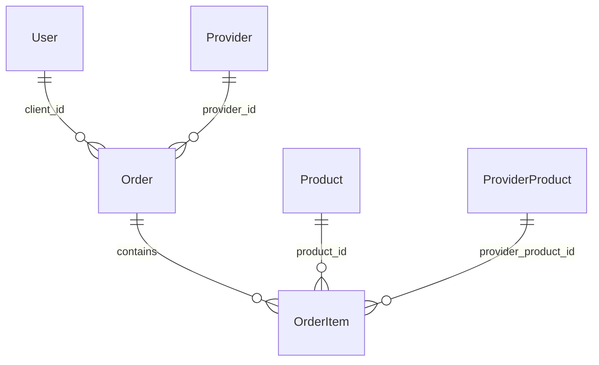

# DB-orders — Entidades Order y OrderItem (Fase 2)

> **Entidades:** `orders`, `order_items`  
> **Módulo:** `ORDERS`  
> **Fecha:** 05/08/2026  
> **Estado:** Diseñado en schema — **NO implementar en MVP Fase 1**

---

## Alcance

Este documento describe el modelo de pedidos existente en `prisma/schema.prisma` para referencia arquitectónica. El flujo checkout, APIs y UI de pedidos están en **roadmap Fase 2 (Q4 2026)**.

La página `/cuenta` mostrará sección "Pedidos" como **placeholder** en MVP.

---

## Order

| Campo | Tipo de Dato | Restricción | Descripción |
| :--- | :--- | :--- | :--- |
| `id` | `String` (cuid) | PRIMARY KEY, NOT NULL | Identificador del pedido |
| `client_id` | `String` | FK → `users.id`, NOT NULL | Cliente que ordena |
| `provider_id` | `String` | FK → `providers.id`, NOT NULL | Frutería que recibe |
| `status` | `OrderStatus` | NOT NULL, DEFAULT `PENDING` | Estado del pedido |
| `total` | `Decimal(10,2)` | NOT NULL, DEFAULT `0` | Total calculado |
| `notes` | `String` | NULLABLE | Notas del cliente |
| `created_at` | `DateTime` | NOT NULL | Fecha del pedido |
| `updated_at` | `DateTime` | NOT NULL | Última actualización |

### OrderStatus

| Valor | Descripción |
|-------|-------------|
| `PENDING` | Pedido creado, pendiente confirmación |
| `CONFIRMED` | Proveedor confirmó |
| `IN_TRANSIT` | En camino / preparación |
| `DELIVERED` | Entregado |
| `CANCELLED` | Cancelado |

---

## OrderItem

| Campo | Tipo de Dato | Restricción | Descripción |
| :--- | :--- | :--- | :--- |
| `id` | `String` (cuid) | PRIMARY KEY, NOT NULL | Identificador línea |
| `order_id` | `String` | FK → `orders.id`, NOT NULL | Pedido padre |
| `product_id` | `String` | FK → `products.id`, NOT NULL | Producto referenciado |
| `provider_product_id` | `String` | FK → `provider_products.id`, NOT NULL | Snapshot precio |
| `quantity` | `Decimal(10,2)` | NOT NULL | Cantidad pedida |
| `unit_price` | `Decimal(10,2)` | NOT NULL | Precio al momento del pedido |
| `subtotal` | `Decimal(10,2)` | NOT NULL | quantity × unit_price |

### Reglas OrderItem

1. **Snapshot de precio:** `unit_price` se congela al crear pedido (no cambia si proveedor actualiza después).
2. **provider_product_id** vincula al precio/disponibilidad vigente al momento del checkout.
3. On delete `Order` → cascade `OrderItem`.

---

## Relaciones

---

## API planificada (Fase 2)

| Método | Ruta | Rol | Descripción |
|--------|------|-----|-------------|
| POST | `/api/orders` | CLIENT | Crear pedido |
| GET | `/api/orders` | CLIENT, PROVIDER | Listar propios |
| GET | `/api/orders/[id]` | CLIENT, PROVIDER, ADMIN | Detalle |
| PATCH | `/api/orders/[id]` | PROVIDER, ADMIN | Cambiar status |

**Prefijo ya reservado:** `CLIENT_PREFIXES` incluye `/api/orders` en `permissions.ts`.

---

## Decisiones pendientes (PM)

| # | Decisión | Impacto |
|---|----------|---------|
| 2 | Contacto tel/WhatsApp vs checkout in-app | Define si Fase 2 implementa estas APIs |
| 1 | Modelo monetización | Arquitectura de pagos Fase 3+ |

---

## Notificaciones (Fase 2)

Al crear/actualizar `Order`:

- WhatsApp o email al proveedor (integración externa)
- Cola async recomendada (BullMQ, Inngest) — evaluar en Fase 2

---

## Referencias

- PRD Fase 2: PM `outputs/laborregamarket/prd.md`
- UX placeholder: `WF-cuenta-cliente.md` sección pedidos
- Schema: `LaBorregaMarket/prisma/schema.prisma` (models `Order`, `OrderItem`)
