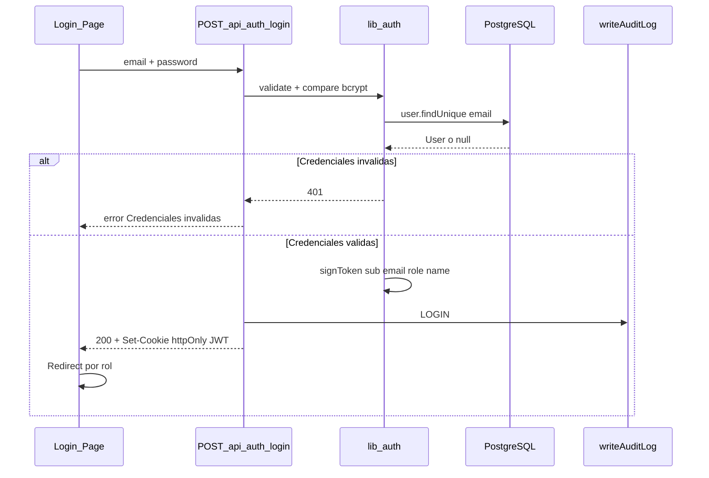
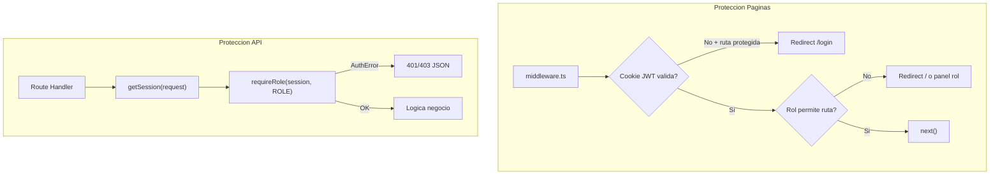

# ARCH-AUTH-01 — Flujo de autenticación y autorización

> **Componente / Flujo:** JWT + RBAC + guards API  
> **Fecha:** 05/08/2026

---

## Flujo de login



---

## Redirect post-login por rol

| Rol | Destino default | Override |
|-----|-----------------|----------|
| `CLIENT` | `/cuenta` o `redirect` param | `?redirect=/explorar` |
| `PROVIDER` | `/proveedor` | Sin Provider → wizard paso 2 |
| `ADMIN` | `/admin` | — |

**Validación `redirect`:** Solo paths internos que empiecen con `/`, sin `//`, sin `http://` ni `https://`.

```typescript
// Patrón de validación (referencia Backend)
function isValidRedirect(path: string): boolean {
  return path.startsWith("/") && !path.startsWith("//") && !path.includes("://");
}
```

---

## Cookie JWT

| Atributo | Valor |
|----------|-------|
| Nombre | Definido en `TOKEN_COOKIE` (`lib/auth/token`) |
| `httpOnly` | `true` |
| `secure` | `true` en `NODE_ENV=production` |
| `sameSite` | `lax` |
| `maxAge` | 7 días (604800 segundos) |
| `path` | `/` |

**Payload JWT:**

```json
{
  "sub": "user_cuid",
  "email": "user@example.com",
  "role": "CLIENT | PROVIDER | ADMIN",
  "name": "Nombre Usuario",
  "iat": 1234567890,
  "exp": 1234567890
}
```

---

## Doble capa de protección



**Importante:** `middleware.ts` retorna `next()` para rutas `/api/*`. Los guards **deben** estar en cada route handler protegido (BL-008).

---

## Matriz de autorización API

| Ruta | Método | Auth | Rol mínimo |
|------|--------|------|------------|
| `/api/auth/login` | POST | Público | — |
| `/api/auth/register` | POST | Público | — |
| `/api/auth/logout` | POST | Opcional | Cualquiera autenticado |
| `/api/providers` | GET | Público | — |
| `/api/providers` | POST | Requerida | PROVIDER (sin Provider previo) |
| `/api/providers/[id]` | GET | Público | — |
| `/api/provider/me` | GET | Requerida | PROVIDER |
| `/api/provider/products` | GET, PATCH | Requerida | PROVIDER |
| `/api/users/me` | GET, PATCH | Requerida | CLIENT |
| `/api/catalogs` | GET | Requerida | ADMIN |
| `/api/admin/*` | * | Requerida | ADMIN |

---

## RBAC granular (ADMIN)

Para operaciones admin sensibles, además de `requireRole(ADMIN)`:

```typescript
await hasModulePermission(session.role, SystemModule.USERS, "view");
```

Matriz en DB: `modules` + `role_permissions` (seed en `prisma/seed.ts`).

---

## Eventos de auditoría AUTH

| Acción | `AuditAction` | Cuándo |
|--------|---------------|--------|
| Login exitoso | `LOGIN` | POST login 200 |
| Logout | `LOGOUT` | POST logout |
| Registro | `CREATE` | POST register 201 (módulo USERS) |

---

## Referencias

- Contrato API: [`../api/API-AUTH-01.md`](../api/API-AUTH-01.md)
- Entidad User: [`../data-model/DB-users.md`](../data-model/DB-users.md)
- Permisos código: `LaBorregaMarket/src/lib/auth/permissions.ts`
