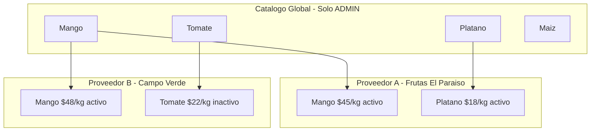
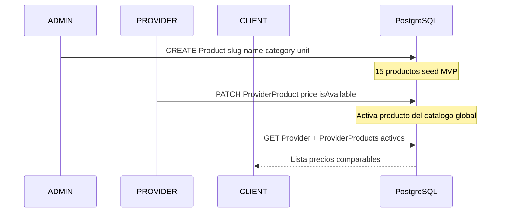

# ARCH-CATALOG-01 — Catálogo global y ProviderProduct

> **Componente / Flujo:** Modelo central de productos comparables  
> **Fecha:** 05/08/2026

---

## Visión del catálogo



**Beneficio cliente:** El mismo producto (ej. Mango) existe en todos los negocios con precios distintos — comparabilidad directa.

**Beneficio proveedor:** No crea productos desde cero; selecciona del catálogo curado y define precio/disponibilidad.

---

## Flujo de datos



---

## Entidades involucradas

| Entidad | Quién escribe | Quién lee |
|---------|---------------|-----------|
| `Product` | ADMIN (CRUD) | Todos (lectura) |
| `ProviderProduct` | PROVIDER (precio, isAvailable) | CLIENT (detalle), PROVIDER (panel) |

### Reglas de negocio

1. **Solo ADMIN** crea/edita/desactiva `Product` en catálogo global (asunción PM A5).
2. **PROVIDER** no puede crear `Product`; solo instancia via `ProviderProduct`.
3. **Unique constraint:** `(providerId, productId)` — un proveedor no duplica producto.
4. **Precio obligatorio** al activar producto nuevo (crear `ProviderProduct`).
5. **isAvailable=false** oculta producto en detalle público y explorar.
6. **Product.isActive=false** (global) excluye de catálogo proveedor aunque exista ProviderProduct.

---

## Categorías y unidades (enums)

### ProductCategory

| Valor | Ejemplos seed |
|-------|---------------|
| `FRUTA` | Mango, Plátano, Naranja, Fresa, Piña, Papaya, Uva |
| `VERDURA` | Tomate, Chile jalapeño, Cebolla, Lechuga, Zanahoria |
| `AGRICOLA` | Maíz, Frijol negro, Arroz |

### ProductUnit

| Valor | Uso típico |
|-------|------------|
| `KG` | Frutas, verduras por peso |
| `PIEZA` | Productos unitarios |
| `MANOJO` | Hierbas, lechuga |
| `CAJA` | Empaque mayorista |
| `LITRO` | Líquidos |
| `GRAMO` | Porciones pequeñas |

---

## Panel proveedor — vista de catálogo

```
GET /api/provider/products
```

Retorna los 15 productos globales activos, cada uno con:

| Campo | Origen |
|-------|--------|
| `product` | `Product` (name, category, unit, slug) |
| `price` | `ProviderProduct.price` o `null` si no activado |
| `isAvailable` | `ProviderProduct.isAvailable` o `false` |
| `providerProductId` | `ProviderProduct.id` o `null` |

**PATCH** activa/desactiva y actualiza precio por `productId`.

---

## Admin — 7 catálogos JSON

`GET /api/catalogs?catalog={name}`

| Catálogo | Entidad |
|----------|---------|
| `users` | `User` |
| `providers` | `Provider` |
| `products` | `Product` |
| `provider-products` | `ProviderProduct` |
| `orders` | `Order` |
| `modules` | `Module` |
| `role-permissions` | `RolePermission` |

MVP: read-only. Edición en roadmap.

---

## Referencias

- Entidades: [`../data-model/DB-products.md`](../data-model/DB-products.md)
- API proveedor: [`../api/API-PROVIDER-01.md`](../api/API-PROVIDER-01.md)
- API admin: [`../api/API-ADMIN-01.md`](../api/API-ADMIN-01.md)
- Schema: `LaBorregaMarket/prisma/schema.prisma`
