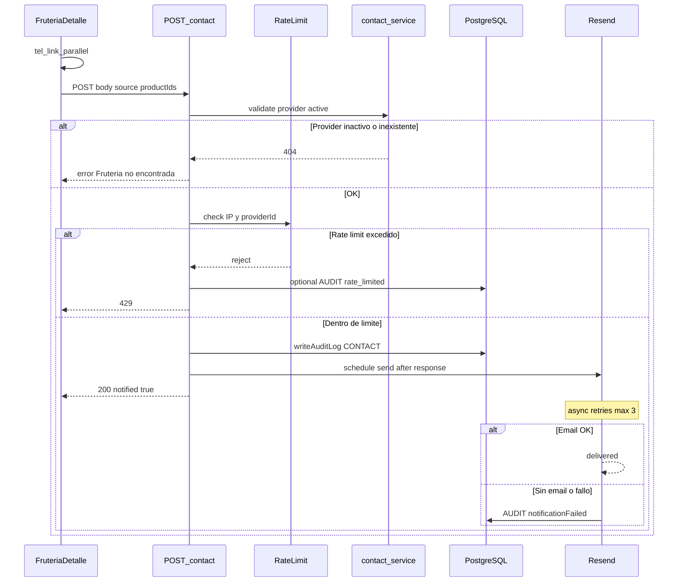
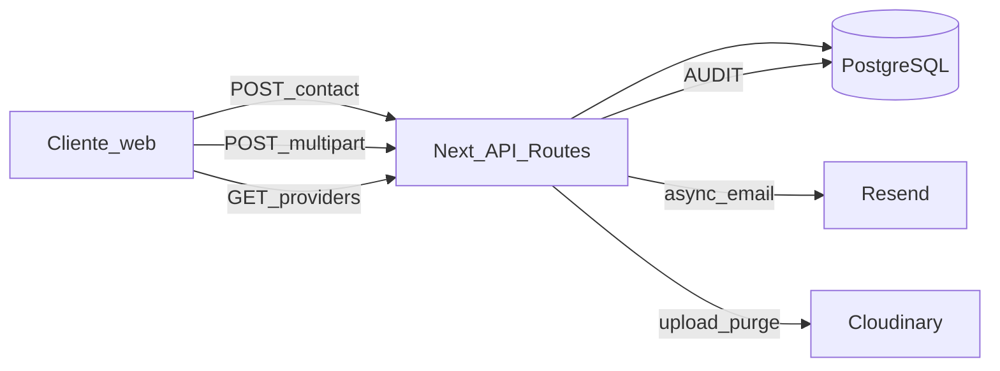

# ARCH-NOTIFY-01 — Flujo de contacto y email async

> **Componente / Flujo:** Contacto cliente → AUDIT CONTACT → Resend async  
> **Fecha:** 10/08/2026  
> **Fase:** 2 — v0.2.0

---

## Secuencia

---

## Topología Fase 2 (terceros)

---

## Reglas rápidas

| Regla | Valor |
|-------|-------|
| Latencia HTTP | &lt; 200 ms |
| Auth | Público; JWT opcional |
| Destinatario | `Provider.user.email` |
| PII cliente | No en email ni AUDIT |
| WhatsApp | Solo Frontend `wa.me` |

---

## Referencias

- [`../api/API-NOTIFY-01.md`](../api/API-NOTIFY-01.md)
- [`../adrs/ADR-005-email-provider.md`](../adrs/ADR-005-email-provider.md)
- [`../adrs/ADR-007-contact-audit-action.md`](../adrs/ADR-007-contact-audit-action.md)
- [`../adrs/ADR-008-notification-async.md`](../adrs/ADR-008-notification-async.md)
