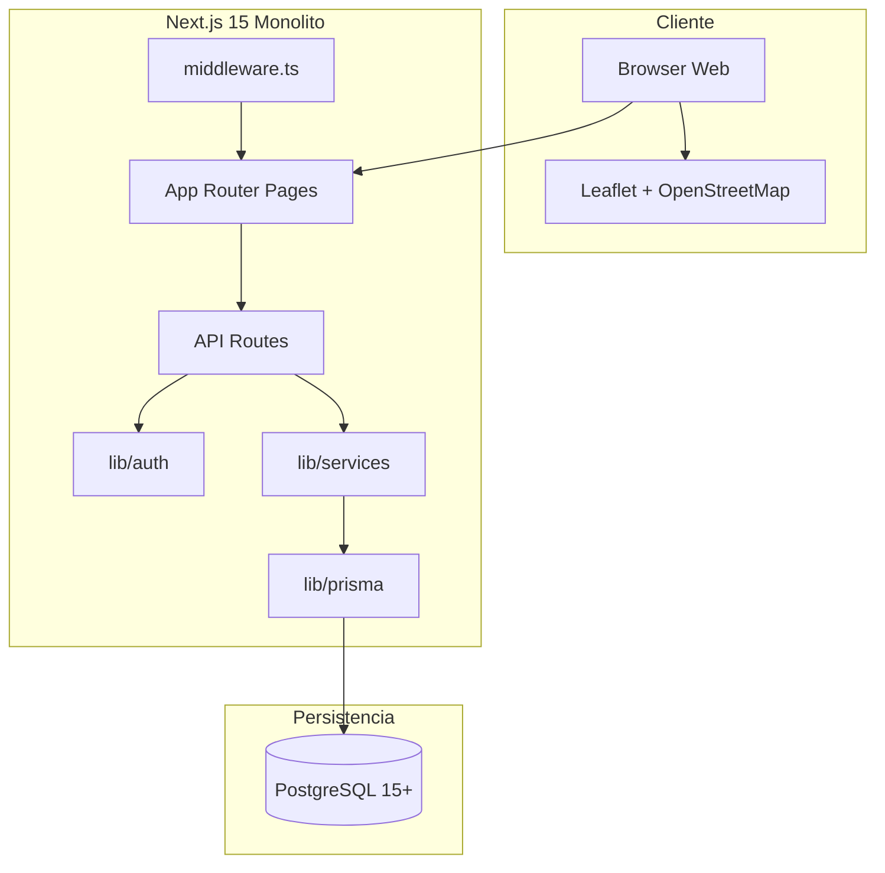
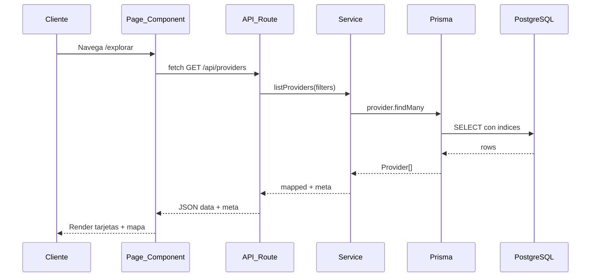
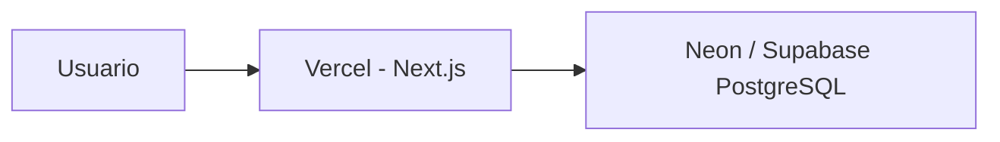

# ARCH-SYSTEM-01 — Topología de contenedores

> **Componente / Flujo:** Arquitectura de sistema LaBorregaMarket v0.1.0  
> **Fecha:** 05/08/2026

---

## Diagrama de contenedores (C4 Level 2)

---

## Descripción de componentes

| Componente | Responsabilidad | Tecnología |
|------------|-----------------|------------|
| **Browser Web** | UI React, formularios, mapa interactivo | React 19, Tailwind CSS 4 |
| **App Router Pages** | Rutas `/`, `/explorar`, `/login`, `/proveedor`, `/admin`, `/cuenta` | Next.js Server/Client Components |
| **API Routes** | REST endpoints bajo `/api/*` | Next.js Route Handlers |
| **middleware.ts** | Protección de **páginas** por rol (no APIs) | Next.js Middleware |
| **lib/auth** | JWT sign/verify, `getSession`, `requireRole`, permisos | jsonwebtoken, bcrypt |
| **lib/services** | Lógica de negocio (a crear por Backend) | TypeScript |
| **lib/prisma** | Acceso a datos ORM | Prisma Client 6 |
| **PostgreSQL** | Persistencia relacional | PostgreSQL 15+ |

---

## Flujo de request típico

---

## Despliegue MVP sugerido

| Entorno | Frontend + API | Base de datos |
|---------|----------------|---------------|
| Desarrollo | `localhost:3000` | PostgreSQL local o Docker |
| Staging/Prod | Vercel | Neon, Supabase o Railway |

---

## Límites del sistema (MVP)

| Dentro del monolito | Fuera de alcance MVP |
|---------------------|----------------------|
| Auth JWT | OAuth / SSO |
| CRUD catálogo proveedor | Checkout / pagos |
| Explorar + detalle | App móvil nativa |
| Admin read-only catálogos | Upload imágenes S3 |
| AuditLog en DB | APM / tracing distribuido |

---

## Referencias

- SAD: [`../sad.md`](../sad.md)
- Auth flow: [`ARCH-AUTH-01.md`](./ARCH-AUTH-01.md)
- Infra: [`../infra-requirements.md`](../infra-requirements.md)
