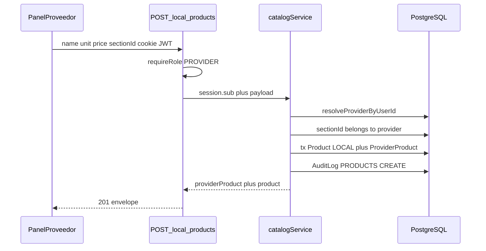
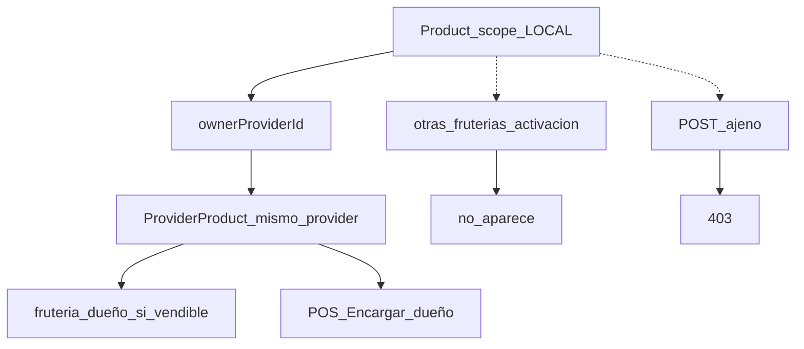
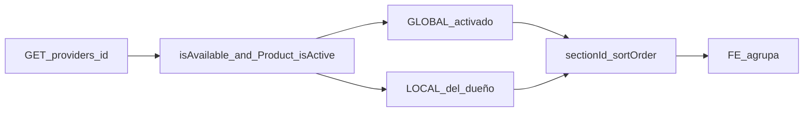

# ARCH-CATALOG-02 — Dual SKU y secciones (Fase 10)

> **Componente / Flujo:** Alta local, aislamiento entre fruterías, agrupación por sección  
> **Fecha:** 28/08/2026  
> **Fase:** 10 — v0.10.2  
> **ADR:** ADR-029, ADR-030

---

## Alta de producto local

---

## Aislamiento

---

## Detalle público agrupado

`category` de Explorar **no** lee secciones. FilterBar F9 intacto.

---

## Qué no entra

- Auto-global.
- Secciones anidadas.
- Hard-delete de `Product` con ventas.

---

## Referencias

- [`../api/API-PROVIDER-PRODUCTS-02.md`](../api/API-PROVIDER-PRODUCTS-02.md)
- [`../api/API-PROVIDER-SECTIONS-01.md`](../api/API-PROVIDER-SECTIONS-01.md)
- [`../../comun/adrs/ADR-029-dual-sku.md`](../../comun/adrs/ADR-029-dual-sku.md)
- [`../../comun/adrs/ADR-030-provider-section.md`](../../comun/adrs/ADR-030-provider-section.md)
