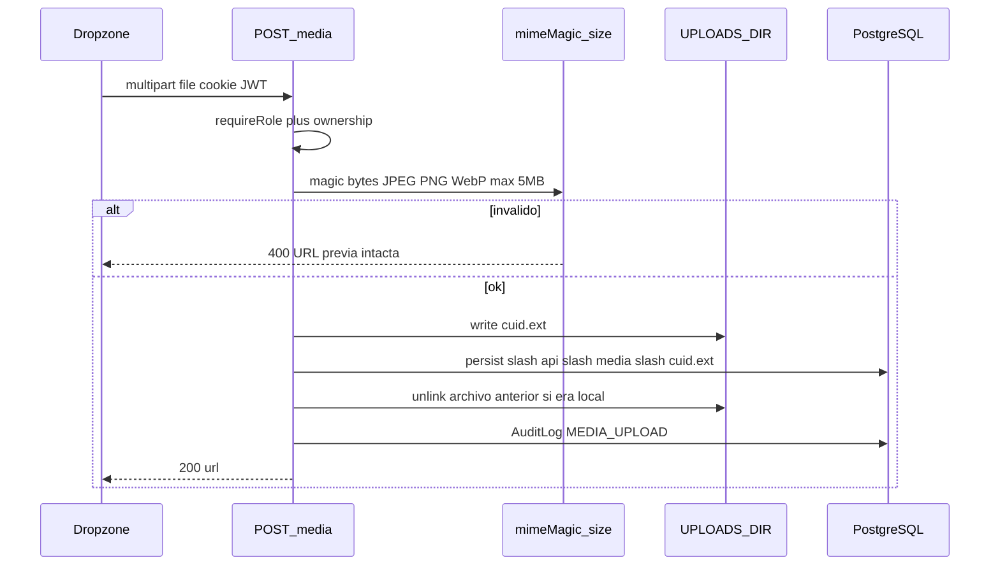
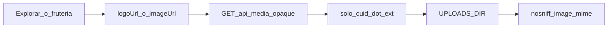
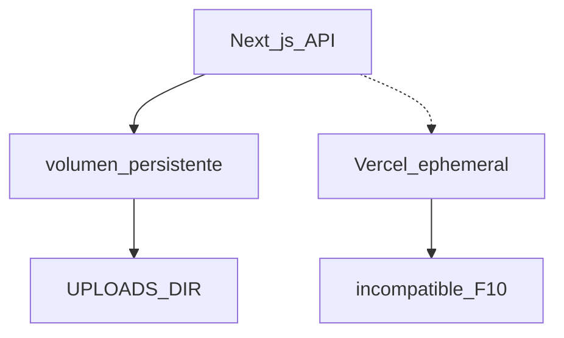

# ARCH-MEDIA-02 — Upload a disco y serving

> **Componente / Flujo:** Validación MIME, persistencia `UPLOADS_DIR`, GET público opaco  
> **Fecha:** 28/08/2026  
> **Fase:** 10 — v0.10.2  
> **ADR:** ADR-032 (ADR-006 aparcado)

---

## Upload PROVIDER (logo / portada / ítem)

---

## Lectura pública

Resolución de foto de producto: `ProviderProduct.imageUrl ?? Product.imageUrl`.

---

## Runtime

---

## Qué no entra

- SDK Cloudinary / S3.
- Path traversal.
- Ejecutables.

---

## Referencias

- [`../api/API-MEDIA-02.md`](../api/API-MEDIA-02.md)
- [`../../comun/adrs/ADR-032-disk-image-storage.md`](../../comun/adrs/ADR-032-disk-image-storage.md)
