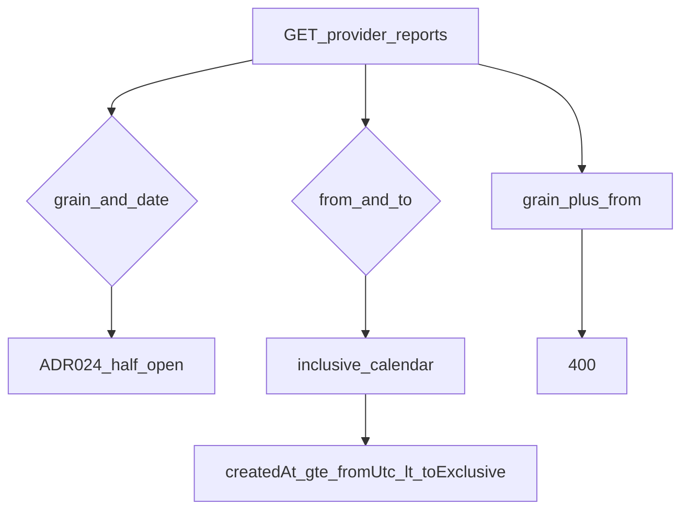
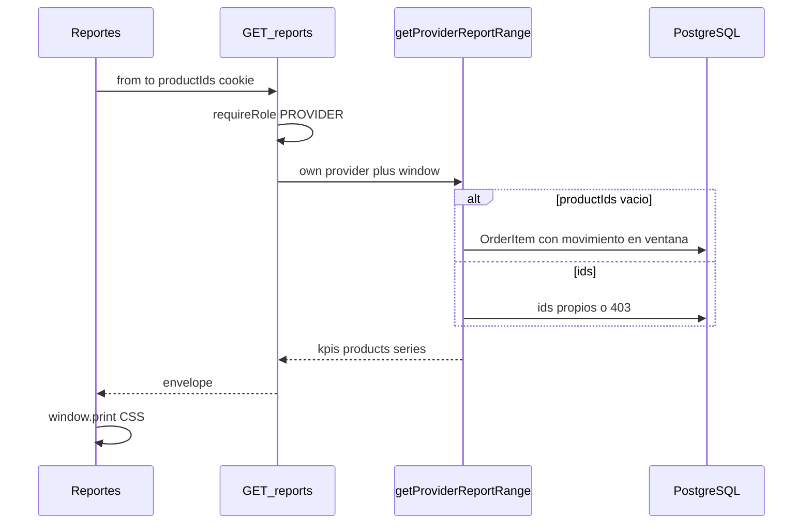

# ARCH-REPORTS-02 — Rango `from`/`to` y filtro por producto

> **Componente / Flujo:** Modo query F10 sobre `GET /api/provider/reports`  
> **Fecha:** 28/08/2026  
> **Fase:** 10 — v0.10.2  
> **ADR:** ADR-033 (ADR-024 grain intacto)

---

## Discriminación de modo

Mes UI: FE setea `from=YYYY-MM-01`, `to=último día`. La API no recibe `month`.

---

## Filtro de productos

Sentinel `quickSale` = `providerProductId IS NULL`. Print = FE (`US-DASH-09`). PDF corte F10 = Should.

---

## Qué no entra

- Editar `fase-6/`.
- ADMIN `providerId` ajeno.
- CSV / CFDI / email.

---

## Referencias

- [`../api/API-PROVIDER-REPORTS-02.md`](../api/API-PROVIDER-REPORTS-02.md)
- [`../api/API-DASH-NOTES-01.md`](../api/API-DASH-NOTES-01.md)
- [`../../comun/adrs/ADR-033-report-date-range.md`](../../comun/adrs/ADR-033-report-date-range.md)
