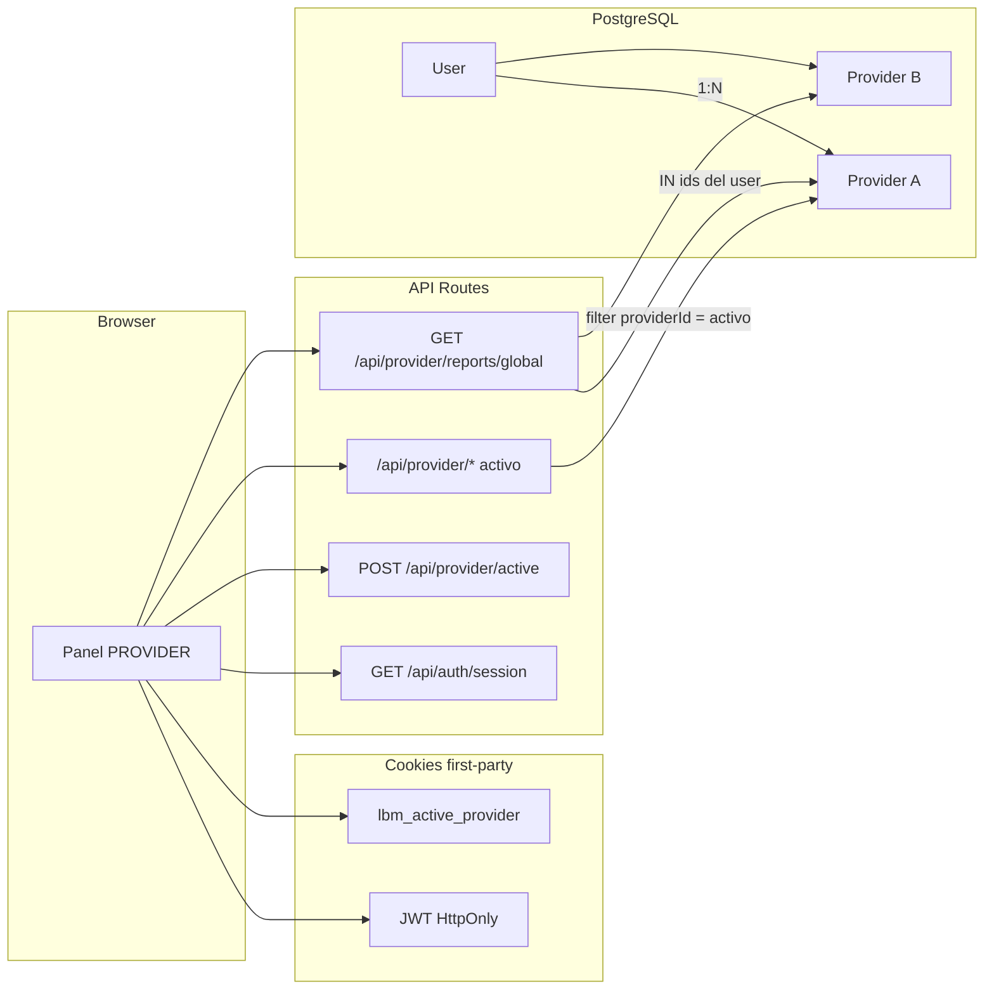

# ARCH-AUTH-11 — Contexto activo 1:N

> **ID:** ARCH-AUTH-11  
> **Fecha:** 12/09/2026  
> **Versión:** 0.11.0  
> **Estado:** Aprobado  
> **US:** US-AUTH-11, US-ISO-01, US-DASH-11

## Inputs Utilizados

- ADR-034, ADR-035, DB-providers F11

El header `X-Active-Provider-Id` no es fuente de verdad.

## Outputs Generados

- **Archivo:** `outputs/laborregamarket/fase-11/diagrams/ARCH-AUTH-11.md`
- **Agente Downstream:** Backend, Frontend
