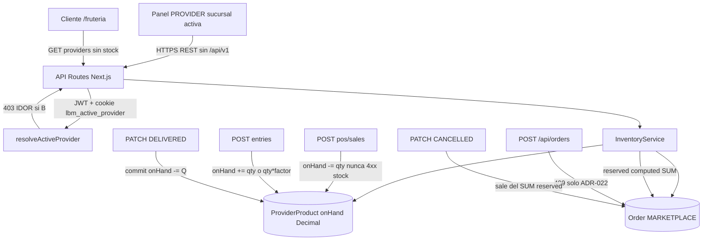

# ARCH-INV-01 — Inventario blando y reservas Encargar

> **Componente / Flujo:** Existencias por sucursal activa, entrada, POS cobro, Encargar  
> **Fecha:** 2026-09-14  
> **Fase:** 12  
> **US:** US-INV-01 … US-INV-06

## Límites

- Disco media F10: GET `/api/media/{opaque}` sin existencias.
- Sin cola nueva. Sin Cloudinary. Sin kardex.

## Outputs Generados

- **Archivo:** `outputs/laborregamarket/fase-12/diagrams/ARCH-INV-01.md`
- **Agente Downstream:** Backend, Frontend
