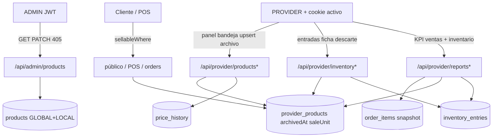

# ARCH-CAT-13 — Archivo, unidad de oferta y reportes inventario

> **Componente / Flujo:** Fase 13 — visibilidad admin, archivo de oferta, unidad/precio por sucursal, entradas  
> **Fecha:** 2026-09-16  
> **ADR:** ADR-038

Reglas: JWT + IDOR 403. Envelope ADR-003. Sin `/api/v1/` (ADR-002). Público sin `archivedAt`. Reportes ventas no JOIN-filtran archivo.

## Outputs Generados

- **Archivo:** `outputs/laborregamarket/fase-13/diagrams/ARCH-CAT-13.md`
- **Agente Downstream:** Backend, Frontend (notas en handoff)
