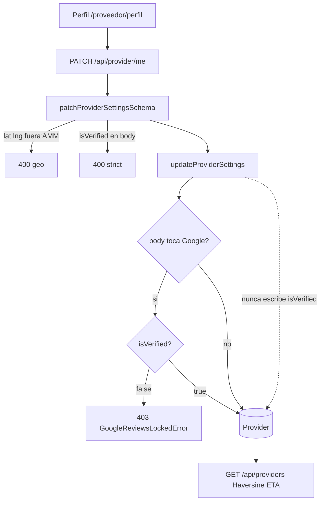

# ARCH-PROF-14 — PATCH datos de negocio y sello verificado

> **Componente / Flujo:** Settings F14 vs Google lock vs Explorar

El pin nuevo alimenta Explorar de inmediato. El sello `isVerified` no se apaga (ADR-039).

## Inputs Utilizados

- ADR-039, API-PROVIDER-SETTINGS-14, ADR-018

## Outputs Generados

- **Archivo:** `outputs/laborregamarket/fase-14/diagrams/ARCH-PROF-14.md`
- **Agente Downstream:** Backend Developer
