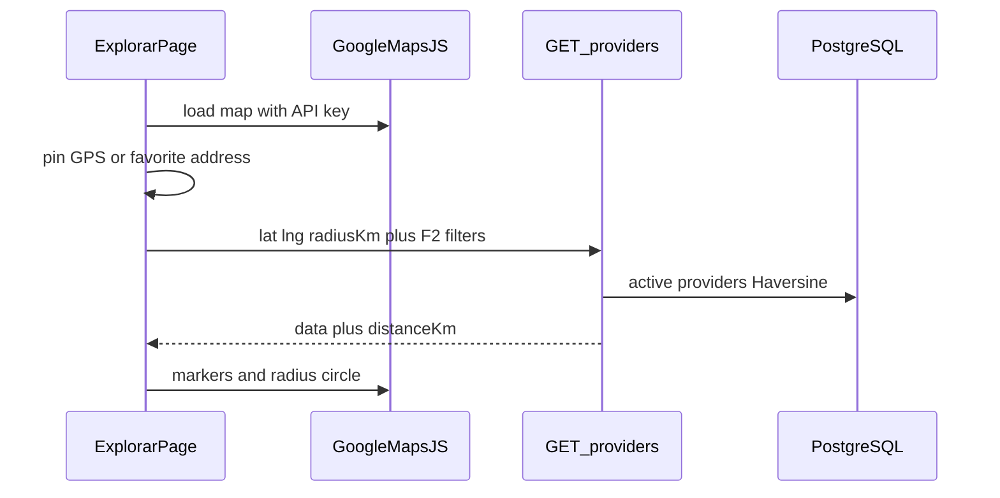
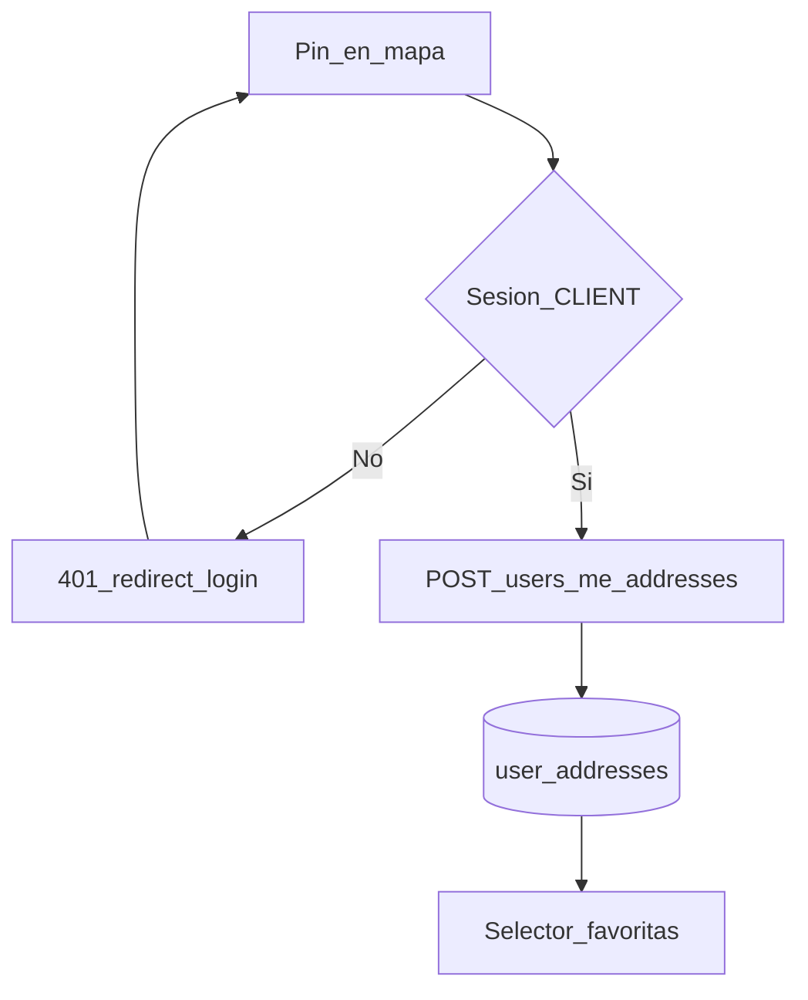
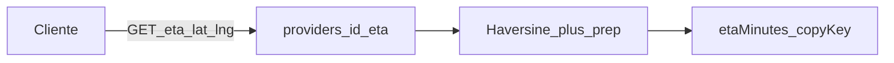

# ARCH-GEO-01 — Mapa, radio y direcciones

> **Componente / Flujo:** `/explorar` Google Maps + filtro Haversine + UserAddress  
> **Fecha:** 14/08/2026  
> **Fase:** 4 — v0.4.0

---

## Flujo explorar con radio

---

## Guardar dirección favorita

---

## ETA preview

Leaflet **no** forma parte de este flujo (ADR-016: reemplazo único).

---

## Referencias

- [`../api/API-GEO-01.md`](../api/API-GEO-01.md)
- [`../api/API-ADDRESSES-01.md`](../api/API-ADDRESSES-01.md)
- [`../../comun/adrs/ADR-016-maps-engine.md`](../../comun/adrs/ADR-016-maps-engine.md)
- [`../../comun/adrs/ADR-017-eta-formula.md`](../../comun/adrs/ADR-017-eta-formula.md)
