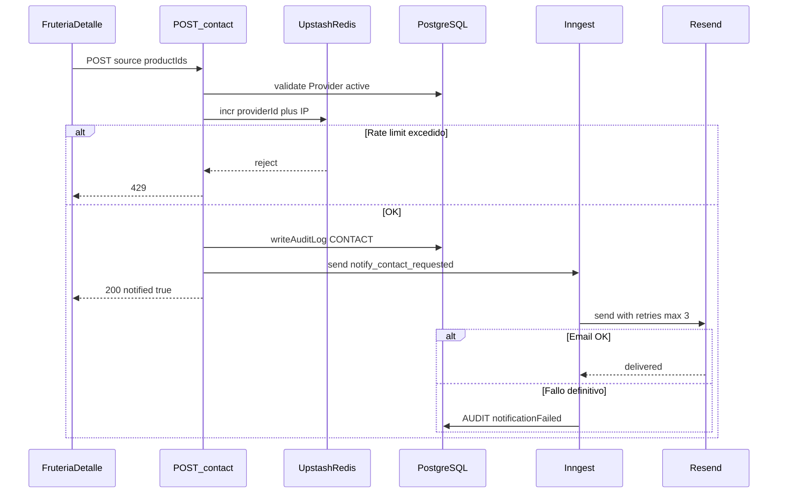
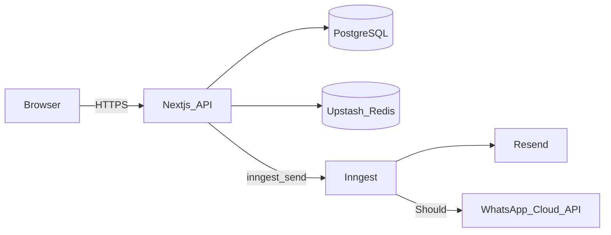

# ARCH-NOTIFY-02 — Cola de notificaciones F4

> **Componente / Flujo:** Contacto y pedido → Redis rate limit → Inngest → Resend / WhatsApp  
> **Fecha:** 14/08/2026  
> **Fase:** 4 — v0.4.0  
> **Reemplaza el path async de** [`../../fase-1/diagrams/ARCH-NOTIFY-01.md`](../../fase-1/diagrams/ARCH-NOTIFY-01.md) (F2 in-process)

---

## Secuencia (contacto)

---

## Topología F4 (terceros)

---

## Eventos Inngest

| name | Origen HTTP | Worker |
|------|-------------|--------|
| `notify/contact.requested` | `POST /api/providers/[id]/contact` | Email contacto |
| `notify/order.created` | `POST /api/orders` | Email pedido (+ WA Should) |
| `notify/order.status` | PATCH status `IN_TRANSIT` | WA cliente Should |

---

## Reglas rápidas

| Regla | Valor |
|-------|-------|
| Latencia HTTP | &lt; 200 ms |
| Rate limit store | Upstash Redis (ADR-015) |
| Retries | ≤3; luego AUDIT `notificationFailed` |
| WhatsApp | Should; no bloquea pedido |
| Path F2 `after()` | Prohibido en prod F4 |

---

## Referencias

- [`../api/API-NOTIFY-01.md`](../api/API-NOTIFY-01.md)
- [`../../comun/adrs/ADR-015-notification-queue.md`](../../comun/adrs/ADR-015-notification-queue.md)
