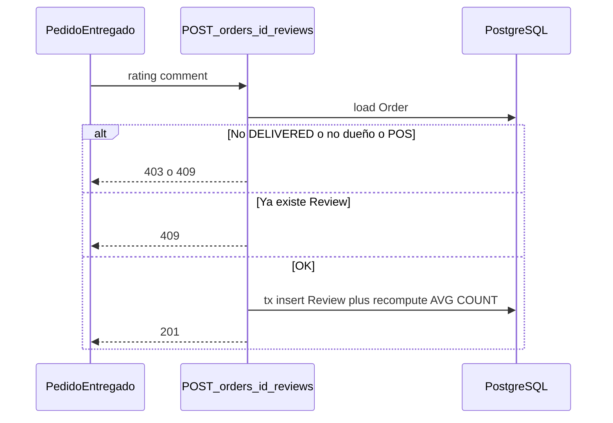
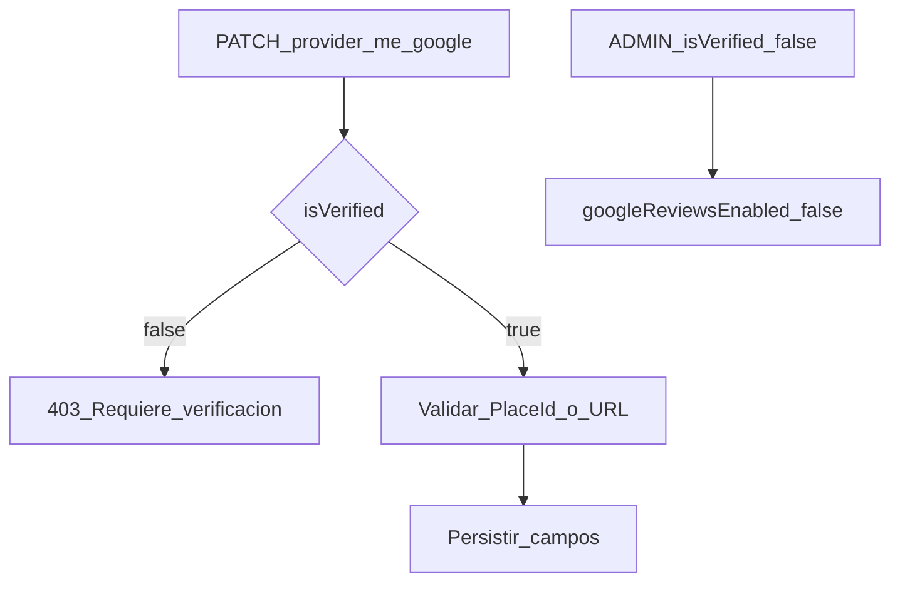
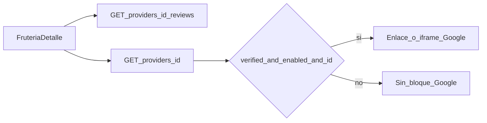

# ARCH-REVIEWS-01 — Reseñas nativas y vitrina Google

> **Componente / Flujo:** Review post-DELIVERED + agregado Provider + gate isVerified  
> **Fecha:** 14/08/2026  
> **Fase:** 4 — v0.4.0

---

## Alta de reseña

---

## Gate Google (escritura)

---

## Lectura pública `/fruteria/[id]`

El promedio nativo **no** incluye reseñas de Google (solo tabla `Review`).

---

## Referencias

- [`../api/API-REVIEWS-01.md`](../api/API-REVIEWS-01.md)
- [`../api/API-PROVIDER-SETTINGS-01.md`](../api/API-PROVIDER-SETTINGS-01.md)
- [`../../comun/adrs/ADR-018-google-reviews.md`](../../comun/adrs/ADR-018-google-reviews.md)
