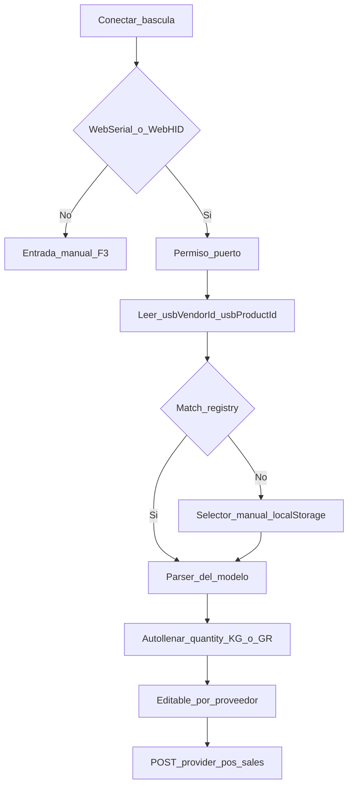

# ARCH-SCALE-01 — Báscula digital (solo cliente)

> **Componente / Flujo:** WebSerial/WebHID → registry VID/PID → `quantity` del ticket POS  
> **Fecha:** 14/08/2026  
> **Fase:** 4 — v0.4.0  
> **Sin API nueva** — [`../../fase-3/api/API-POS-01.md`](../../fase-3/api/API-POS-01.md) intacto

---

## Flujo de conexión

---

## Límites

| Hecho | Destino |
|-------|---------|
| Peso leído | Estado UI → `quantity` |
| VID/PID / stream | **Nunca** al servidor |
| Preferencia modelo | `localStorage` (`lbm.scale.driverId`) |
| Contrato venta | ADR-014 / API-POS-01 sin campos extra |

Desconexión: badge + reconectar o manual. Parse fallido: no pisar `quantity`.

---

## Referencias

- [`../../comun/adrs/ADR-019-scale-drivers.md`](../../comun/adrs/ADR-019-scale-drivers.md)
- US-POS-05, US-POS-06
