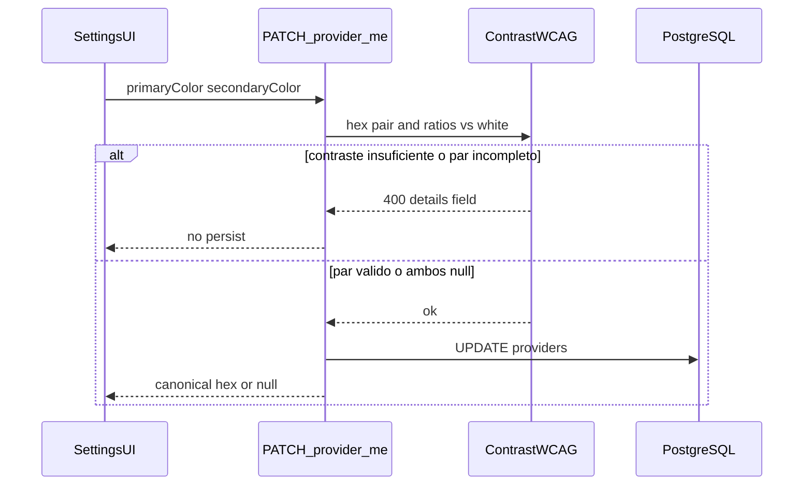
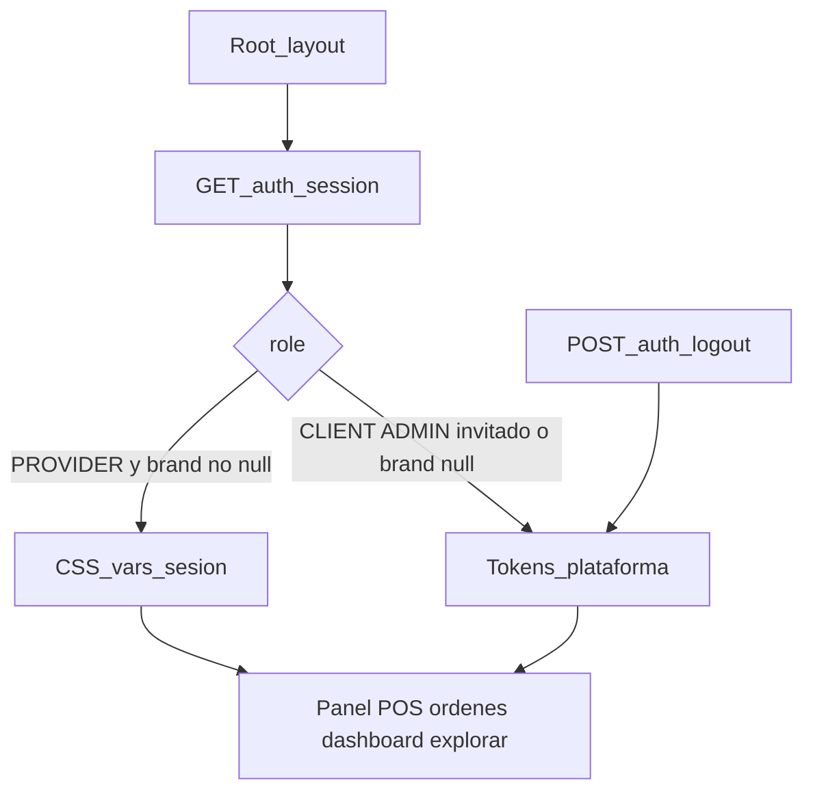

# ARCH-BRAND-01 — Tema de sesión PROVIDER

> **Componente / Flujo:** Colores primario/secundario persistidos + hidratación CSS scoped  
> **Fecha:** 14/08/2026  
> **Fase:** 5 — v0.5.0

---

## Escritura (US-BRAND-01)

ADMIN usa `PATCH /api/admin/providers/[id]` con la misma validación. Gate Google 403 **no** aplica a colores.

---

## Hidratación (US-BRAND-02)

`GET /api/auth/session` siempre **200**. CLIENT viendo `/fruteria/[id]` **no** pinta el chrome con los colores de esa frutería.

Estados de pedido: tokens de feedback F3, no `--brand`.

---

## Referencias

- [`../../comun/adrs/ADR-021-provider-brand-colors.md`](../../comun/adrs/ADR-021-provider-brand-colors.md)
- [`../api/API-PROVIDER-SETTINGS-01.md`](../api/API-PROVIDER-SETTINGS-01.md)
- [`../api/API-SESSION-THEME-01.md`](../api/API-SESSION-THEME-01.md)
- [`../data-model/DB-providers.md`](../data-model/DB-providers.md)
