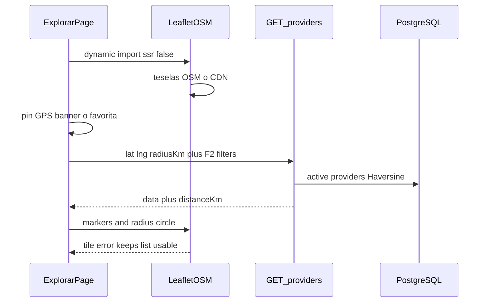
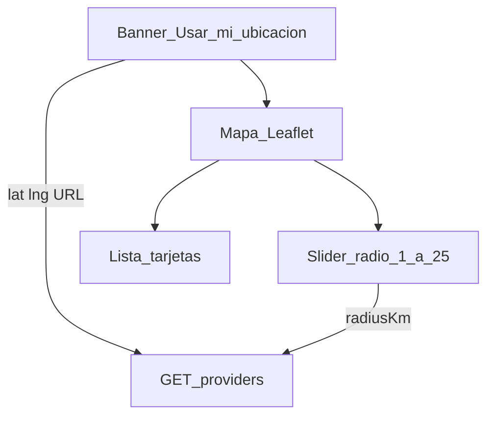
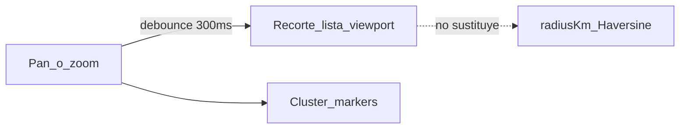

# ARCH-GEO-02 — Explorar con Leaflet/OSM

> **Componente / Flujo:** `/explorar` Leaflet + teselas OSM + filtro Haversine (query F4 intacta)  
> **Fecha:** 14/08/2026  
> **Fase:** 5 — v0.5.0

---

## Flujo explorar (motor F5)

El servidor no sirve teselas. Markers = mismo `data[]` que la lista. Query: [`../api/API-GEO-01.md`](../api/API-GEO-01.md) (delta motor) + [`../../fase-4/api/API-GEO-01.md`](../../fase-4/api/API-GEO-01.md) (Haversine).

---

## Layout (US-GEO-05, FE)

Favoritas F4 se conservan (selector compacto o en banner: UX). Radio **no** es bounding box.

---

## Should (no Must API)

API `south/west/north/east` = Could, no especificada.

---

## Qué ya no aplica

Google Maps JS en `/explorar` (ADR-016 **Reemplazado**). Embed/URL de reseñas Google en ficha de frutería verificada (ADR-018) **sí** permanece, fuera de este diagrama.

ARCH-GEO-01 F4 queda como histórico del diseño Maps JS; la narrativa F5 usa este archivo.

---

## Referencias

- [`../../comun/adrs/ADR-020-maps-engine-leaflet.md`](../../comun/adrs/ADR-020-maps-engine-leaflet.md)
- Addresses F4: [`../../fase-4/api/API-ADDRESSES-01.md`](../../fase-4/api/API-ADDRESSES-01.md)
- ETA: [`../../comun/adrs/ADR-017-eta-formula.md`](../../comun/adrs/ADR-017-eta-formula.md)
