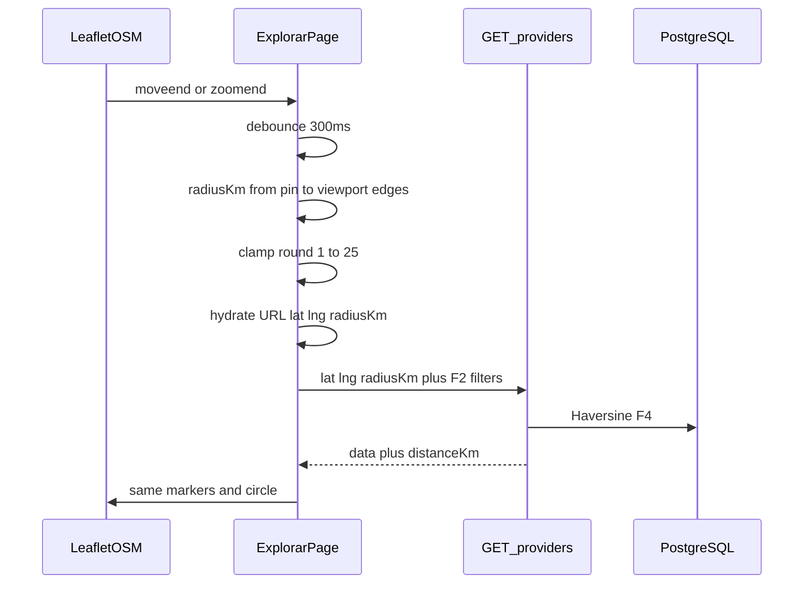
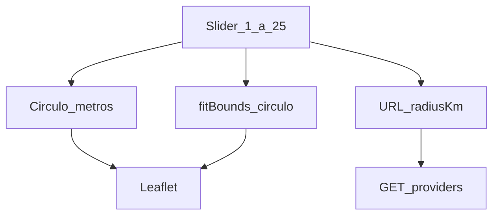
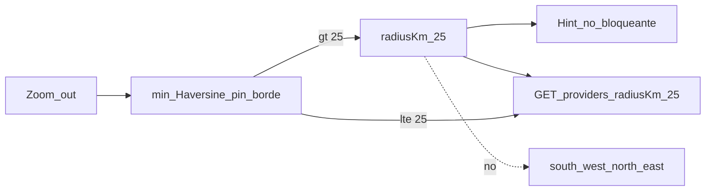

# ARCH-GEO-03 — Zoom y slider = mismo radio Haversine

> **Componente / Flujo:** `/explorar` deriva `radiusKm` del viewport; reusa GET providers F4  
> **Fecha:** 16/08/2026  
> **Fase:** 6 — v0.6.1

El motor Leaflet/OSM (ARCH-GEO-02) no cambia. Este diagrama es el **sync** visualizador ↔ slider ↔ lista.

---

## Sync zoom / pan → radio

Si el pin está fuera del viewport, no se recalcula el radio (se conserva el último).

---

## Slider → mapa

---

## Clamp 25 km (sin bbox)

---

## Loading lista (US-GEO-08)

Cero API. Durante el refetch: loop B1–B3 en la lista (`aria-busy`). Mapa y círculo visibles. Fallo: ErrorBanner + lista previa.

---

## Referencias

- [`../api/API-GEO-01.md`](../api/API-GEO-01.md)
- Append [`../../comun/adrs/ADR-020-maps-engine-leaflet.md`](../../comun/adrs/ADR-020-maps-engine-leaflet.md)
- Query F4: [`../../fase-4/api/API-GEO-01.md`](../../fase-4/api/API-GEO-01.md)
- Motor F5: [`../../fase-5/diagrams/ARCH-GEO-02.md`](../../fase-5/diagrams/ARCH-GEO-02.md)
