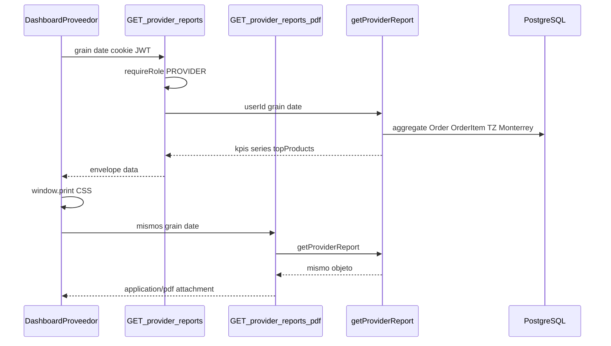
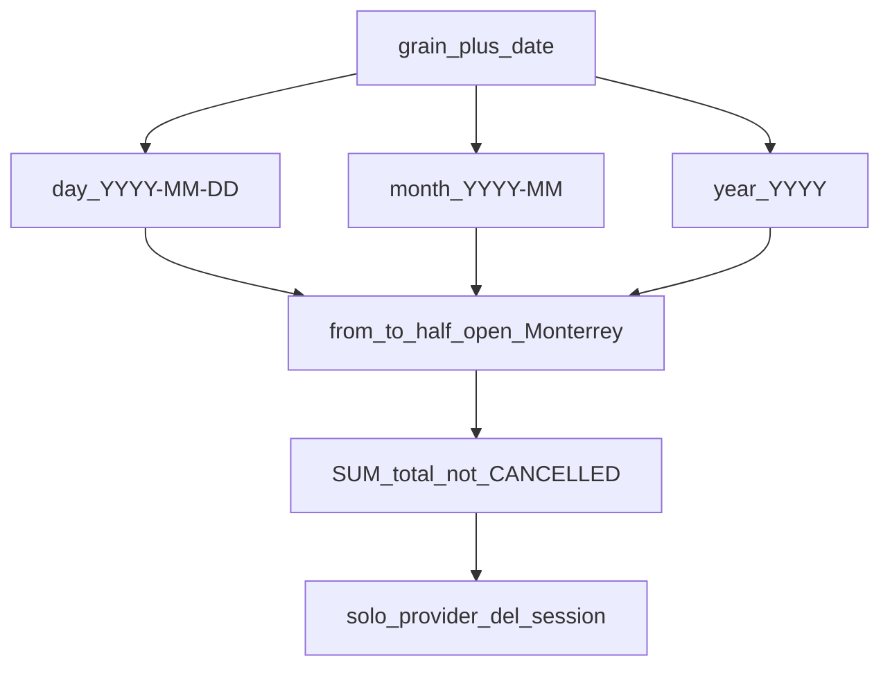
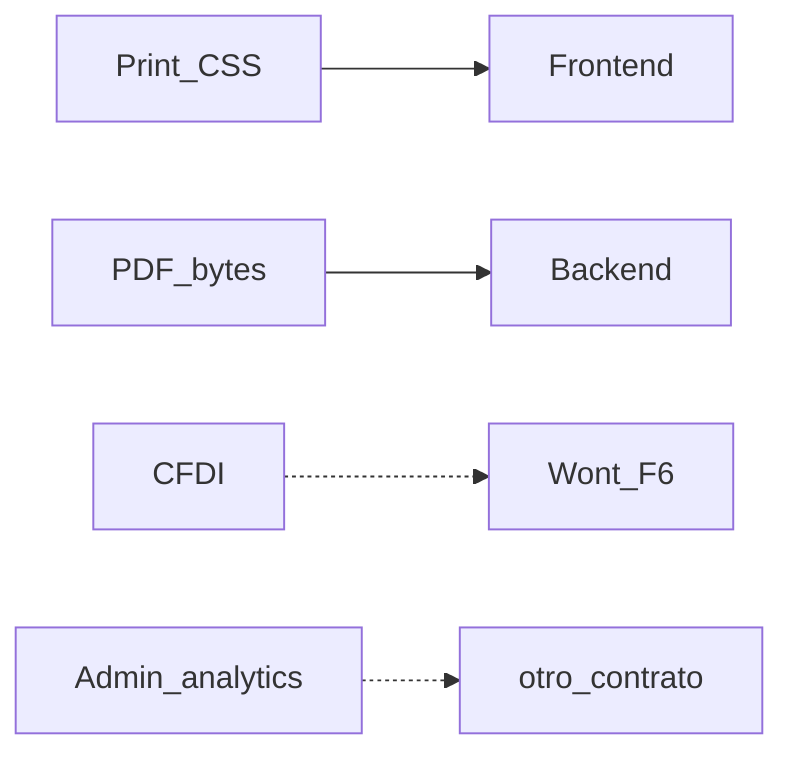

# ARCH-REPORTS-01 — Reporte calendario PROVIDER

> **Componente / Flujo:** Ventanas day/month/year + JSON + PDF servidor + print cliente  
> **Fecha:** 16/08/2026  
> **Fase:** 6 — v0.6.1

---

## Lectura del reporte

`GET /api/provider/dashboard` (rolling F3) no aparece: vista por defecto intacta, contrato distinto.

---

## Ventanas (ADR-024)

Periodo futuro → 400. Periodo en curso → permitido. Sin schema nuevo.

---

## Qué no entra

---

## Referencias

- [`../api/API-PROVIDER-REPORTS-01.md`](../api/API-PROVIDER-REPORTS-01.md)
- [`../api/API-PROVIDER-REPORTS-PDF-01.md`](../api/API-PROVIDER-REPORTS-PDF-01.md)
- [`../../comun/adrs/ADR-023-report-pdf.md`](../../comun/adrs/ADR-023-report-pdf.md)
- [`../../comun/adrs/ADR-024-calendar-windows.md`](../../comun/adrs/ADR-024-calendar-windows.md)
