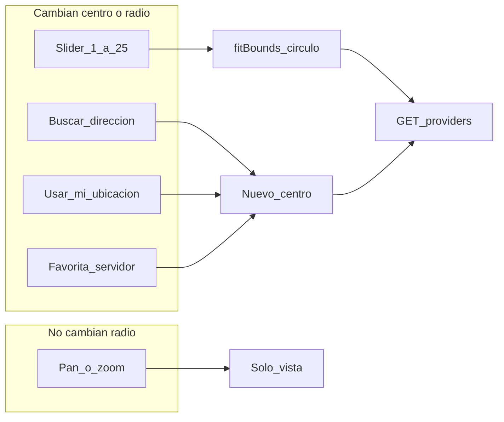
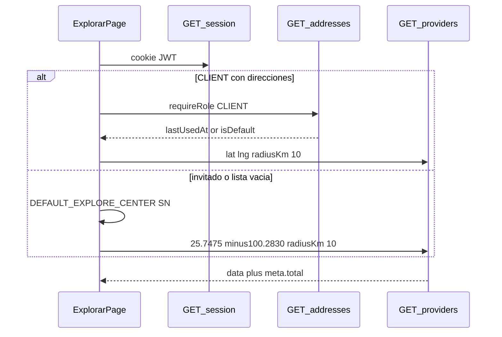
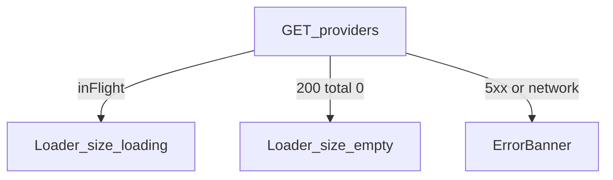

# ARCH-GEO-04 — Radio slider + default San Nicolás (Fase 7)

> **Componente / Flujo:** `/explorar` — pan solo vista; Haversine desde slider; centro SN o favorita  
> **Fecha:** 18/08/2026  
> **Fase:** 7 — v0.7.1

Motor Leaflet/OSM (ARCH-GEO-02) no cambia. F6 ARCH-GEO-03 (pan→radio) queda **histórico**.

---

## Quién dispara GET

---

## Primera carga

---

## Empty (US-GEO-16)

---

## Referencias

- [`../api/API-GEO-01.md`](../api/API-GEO-01.md)
- ADR-020 append F7, ADR-026, ADR-027
