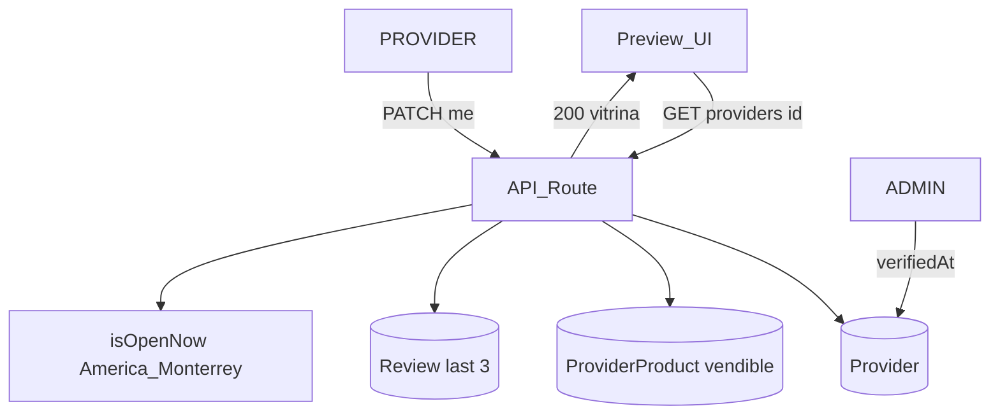

# ARCH-PREVIEW-01 — Vitrina proveedor (Fase 7)

> **Componente / Flujo:** `GET /api/providers/[id]` preview Explorar  
> **Fecha:** 18/08/2026  
> **Fase:** 7 — v0.7.1

---

## Lectura pública

---

## Flags de vitrina

| Flag | Origen | UI si false/ausente |
|------|--------|---------------------|
| `offersDelivery` | F4 | No afirmar envío |
| `acceptsCardAtStore` | F7 | No afirmar tarjeta |
| `whatsappEnabled` + `phone` | F7 | No afirmar WA |
| `offersWholesale` / `offersRetail` | F7 | Mostrar solo los true |
| `hoursPublished` | `openingHours` no vacío | “Horario no publicado” |
| `isVerified` + `verifiedAt` | ADMIN | Sin copy MM/AAAA |

Sin Maps JS. Sin pasarela.

---

## Referencias

- [`../api/API-PROVIDER-PREVIEW-01.md`](../api/API-PROVIDER-PREVIEW-01.md)
- [`../data-model/DB-providers.md`](../data-model/DB-providers.md)
