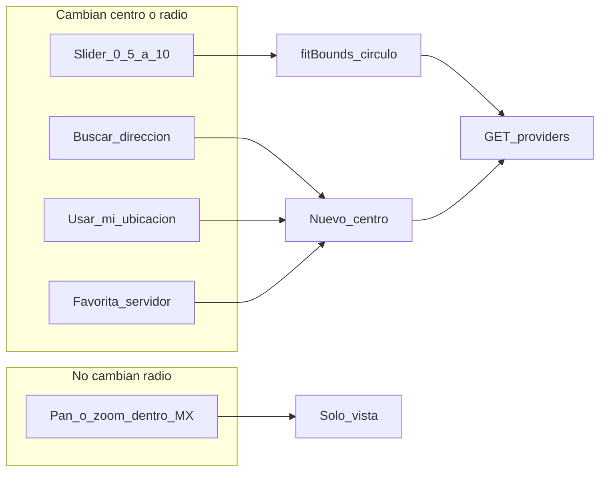
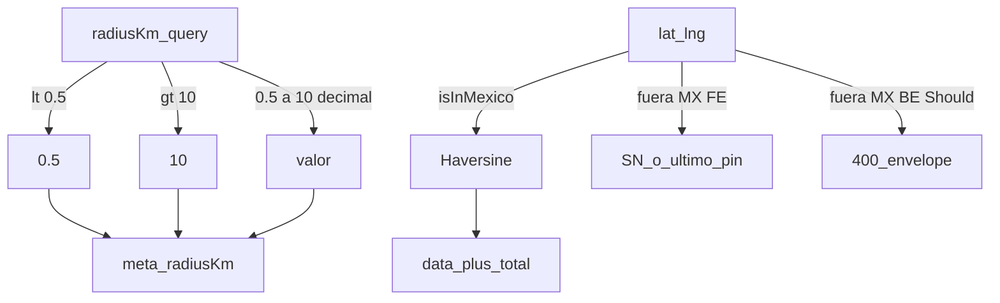
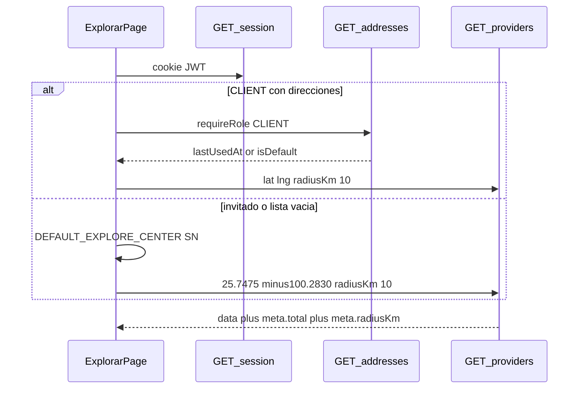
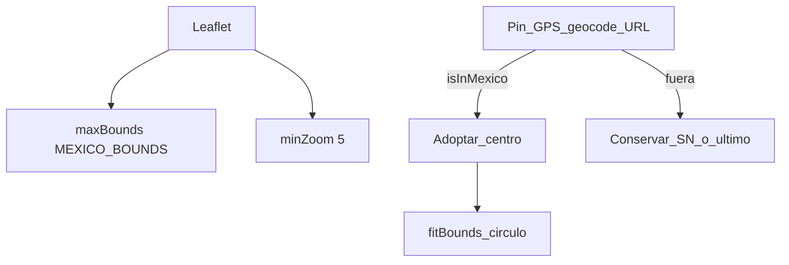

# ARCH-GEO-05 — Radio 0.5–10 km + mapa México (Fase 8)

> **Componente / Flujo:** `/explorar` — clamp decimal; pan solo vista dentro de MX; Haversine desde slider  
> **Fecha:** 24/08/2026  
> **Fase:** 8 — v0.8.3

Motor Leaflet/OSM (ARCH-GEO-02) no cambia. F7 ARCH-GEO-04 (slider 1–25, bbox AMM en API) queda **histórico**. `CO-F7-001` intacto.

---

## Quién dispara GET

---

## Clamp y México

`Math.round` **prohibido**. Círculo = `radiusKm * 1000` m. Bbox MX **no** es el predicado de lista.

---

## Primera carga

URL `radiusKm=22` → FE y BE clampa a 10 **antes** del GET efectivo (`meta.radiusKm=10`).

---

## Viewport México (Must FE)

---

## Referencias

- [`../api/API-GEO-01.md`](../api/API-GEO-01.md)
- ADR-020 append F8, ADR-028, ADR-026, ADR-027
