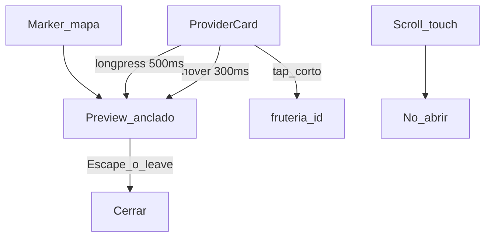
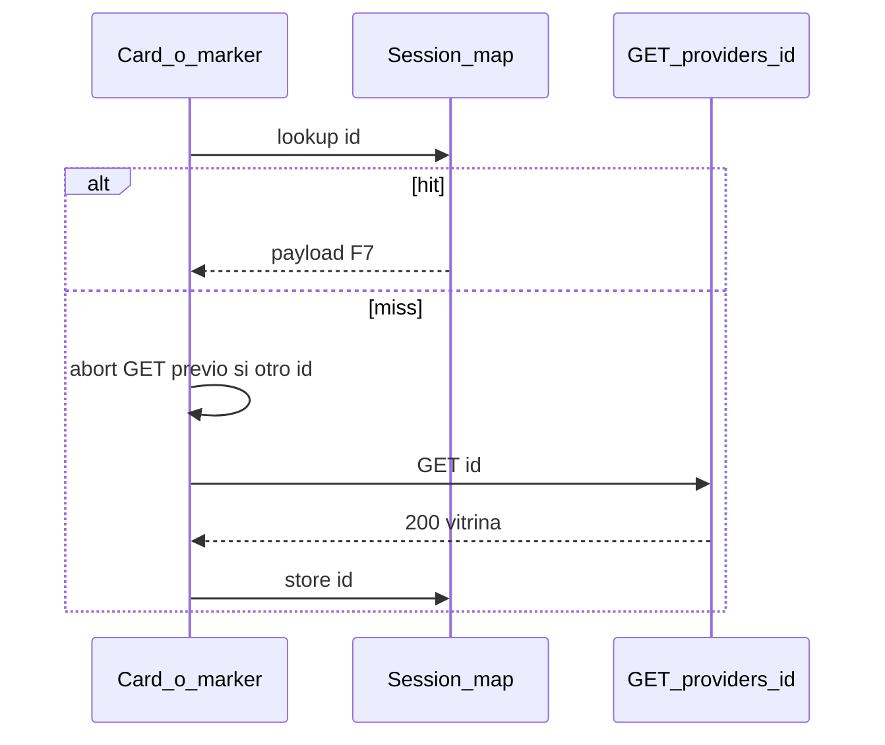

# ARCH-PREVIEW-02 — Hover / long-press (Fase 8)

> **Componente / Flujo:** `/explorar` preview anclado; mismo `GET /api/providers/[id]`  
> **Fecha:** 24/08/2026  
> **Fase:** 8 — v0.8.3

El payload de vitrina no cambia (ARCH-PREVIEW-01). Solo cambia el disparador y el control de requests.

---

## Disparo (sin botón)

---

## Un GET, cache de sesión

Cruzar el grid **no** dispara N requests. Máximo un preview abierto.

---

## Referencias

- [`../api/API-PROVIDER-PREVIEW-01.md`](../api/API-PROVIDER-PREVIEW-01.md)
- Shape F7: [`../../fase-7/api/API-PROVIDER-PREVIEW-01.md`](../../fase-7/api/API-PROVIDER-PREVIEW-01.md)
