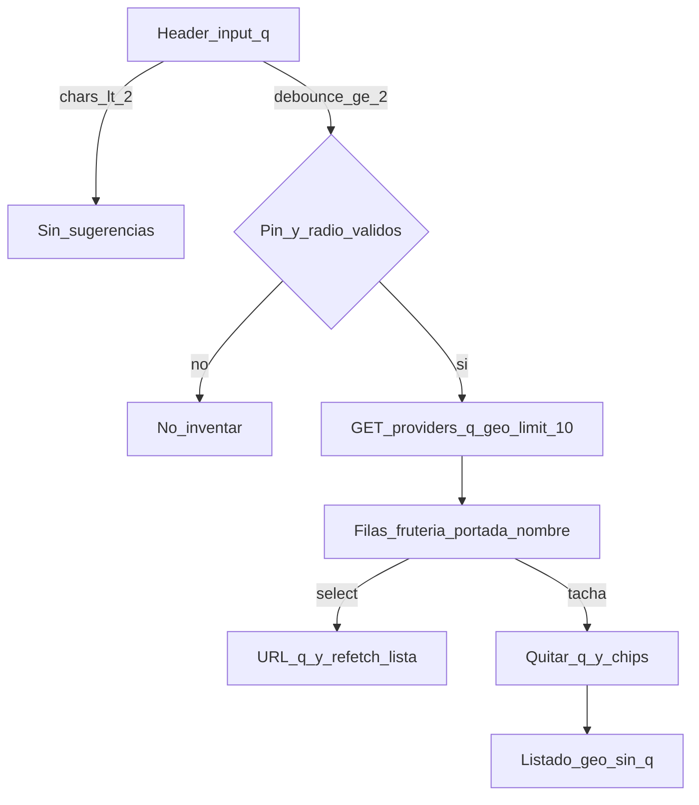
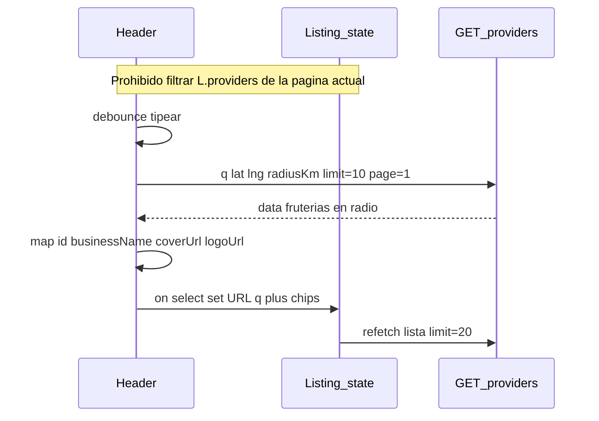
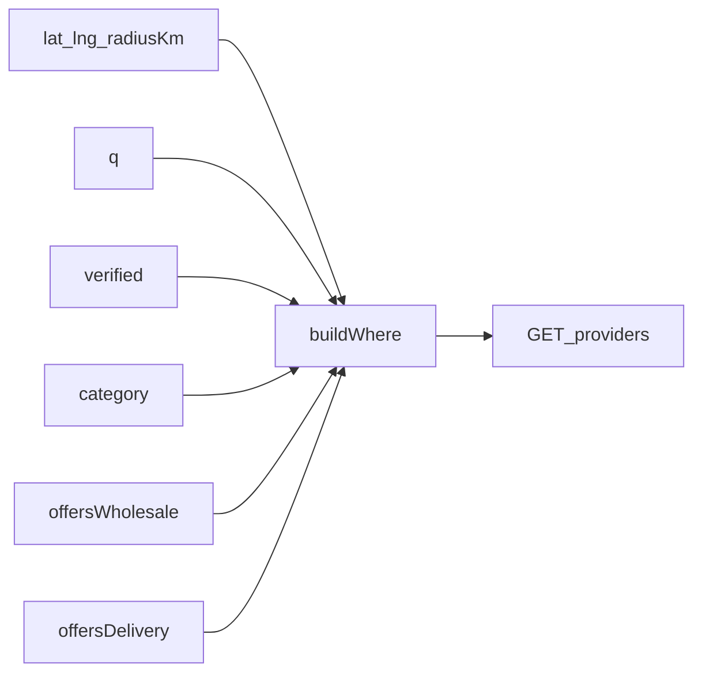

# ARCH-EXPLORE-TYPEAHEAD-01 — Typeahead header (Fase 9)

> **Componente / Flujo:** `/explorar` header typeahead; mismo `GET /api/providers`  
> **Fecha:** 25/08/2026  
> **Fase:** 9 — v0.9.0  
> **US:** US-EXPLORE-09

Sin endpoint `/suggest`. Corpus = predicado Haversine + `q` en servidor (no página FE).

---

## Flujo UI

---

## Sequence: debounce + corpus radio

---

## Chips AND (US-EXPLORE-11)

Orgánico y chip «Filtros» **retirados** (D-F9-2). Sin schema nuevo.

---

## Referencias

- Contrato: [`../api/API-GEO-01.md`](../api/API-GEO-01.md)
- Handoff: [`../handoff-backend-fase-9.md`](../handoff-backend-fase-9.md)
- Notas sin API: [`../api/API-EXPLORE-NOTES-01.md`](../api/API-EXPLORE-NOTES-01.md)
