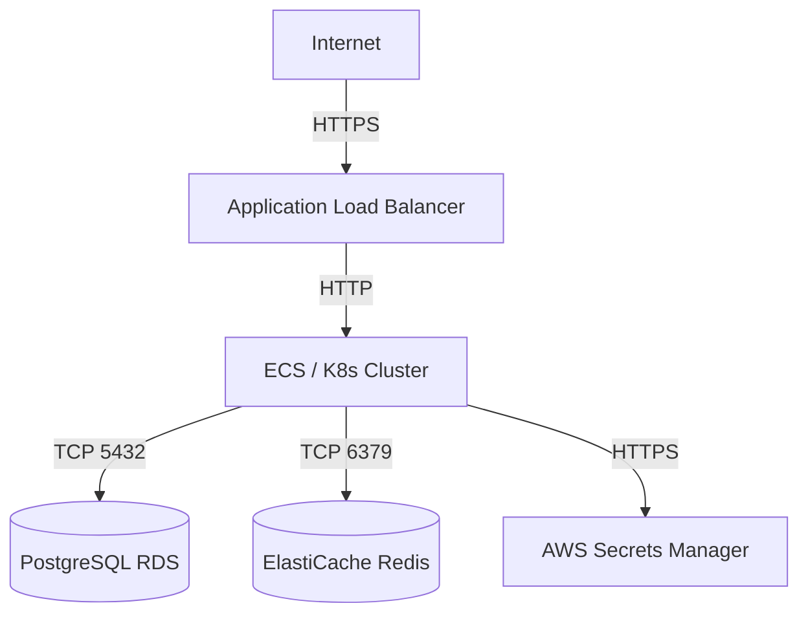

# Handoff de Infraestructura: INFRA-{Component}

> **Proyecto:** `{nombre-proyecto}`  
> **Componente:** `{Component}` (ej. API, Frontend, Database)  
> **Entorno:** `{environment}` (staging / production)  
> **Fecha:** `{YYYY-MM-DD}`  
> **Generado por:** Agente DevOps / Cloud Engineer Senior

---

## 1. Resumen de infraestructura provisionada

| Recurso | Identificador | Región | Notas |
|---------|---------------|--------|-------|
| ECS Cluster / K8s Cluster | `{cluster-name}` | `{region}` | |
| Container Registry | `{registry-url}` | `{region}` | Imágenes etiquetadas con commit SHA |
| Load Balancer | `{alb-dns}` | `{region}` | |
| Base de Datos | `{db-endpoint}` | `{region}` | RPO: 15 min (PITR habilitado) |
| Secret Manager | `{secret-arn}` | `{region}` | |

---

## 2. Topología de red (para Arquitecto)

### Subnets y Security Groups

| Recurso | CIDR / ID | Security Group | Reglas inbound |
|---------|-----------|----------------|----------------|
| Public Subnet | `{cidr}` | `sg-alb-{env}` | 443 desde 0.0.0.0/0 |
| Private Subnet (App) | `{cidr}` | `sg-app-{env}` | 3000 desde sg-alb |
| Private Subnet (DB) | `{cidr}` | `sg-db-{env}` | 5432 desde sg-app |

---

## 3. Pipeline CI/CD

| Etapa | Estado | Notas |
|-------|--------|-------|
| Lint & Unit Tests | ✅ Configurado | |
| Build & Trivy Scan | ✅ Configurado | Bloquea CRITICAL/HIGH |
| Push to Registry | ✅ Configurado | Tag: `${{ github.sha }}` |
| Deploy Staging | ✅ Configurado | Rolling update |
| E2E Tests (QA) | ✅ Configurado | Post-deploy staging |
| Deploy Production | ⏳ Pendiente aprobación QA | Requiere sign-off |

**Archivo pipeline:** `.github/workflows/ci-cd.yml`

---

## 4. Observabilidad

| Pilar | Herramienta | Estado |
|-------|-------------|--------|
| Métricas | Prometheus + Grafana | ✅ Alertas Golden Signals |
| Logs | Fluent Bit → CloudWatch | ✅ JSON estructurado |
| Traces | OpenTelemetry → Jaeger | ✅ Auto-instrumentación |

**Archivos:** `observability/prometheus-alerts.yaml`, `observability/otel-config.yaml`

---

## 5. Información para QA

| Campo | Valor |
|-------|-------|
| URL Staging | `https://staging.{dominio}.com` |
| URL Production | `https://{dominio}.com` (post sign-off) |
| Comando E2E | `npm run test:e2e` |
| Trigger E2E en pipeline | Job `e2e-tests` post `deploy-staging` |
| Credenciales de prueba | Ver `{secret-name}` en Secrets Manager |

---

## 6. Disaster Recovery

| Métrica | Objetivo | Implementación |
|---------|----------|----------------|
| RPO | ≤ 15 minutos | Snapshots RDS automáticos + PITR |
| RTO | ≤ 1 hora | `terraform apply` + pipeline CI/CD |

**Procedimiento de recuperación:**
1. Restaurar RDS desde snapshot/PITR más reciente.
2. Ejecutar `terraform apply` para reconstruir infraestructura.
3. Disparar pipeline CI/CD para redeploy de imágenes.

---

## 7. Definition of Done — DevOps

- [ ] Docker inmutable: multi-stage, non-root, Trivy sin CRITICAL/HIGH
- [ ] IaC validado: `terraform fmt` + `terraform validate` + S3 backend
- [ ] Pipeline seguro: lint, tests, SAST, secrets en secret manager
- [ ] Health checks: liveness/readiness en manifiestos
- [ ] Alertamiento activo: CPU/Mem >85%, HTTP 5xx, fallos de deploy

---

## 8. Próximos pasos

| Responsable | Acción |
|-------------|--------|
| QA | Ejecutar suite E2E en staging y emitir `QA-{Module}-signoff.md` |
| Arquitecto | Auditar topología de red y SGs contra SAD |
| DevOps | Deploy a production tras sign-off QA |
