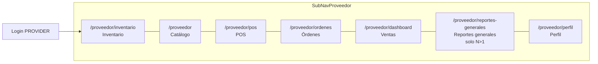
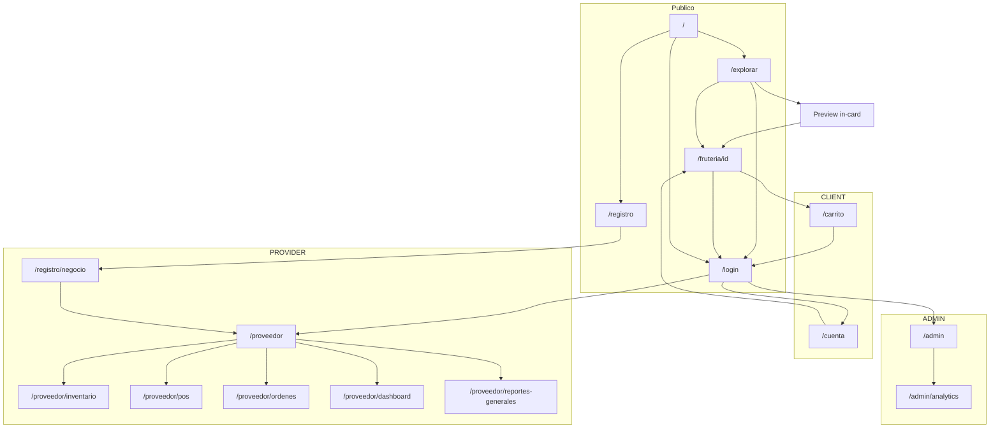

# Arquitectura de Información — LaBorregaMarket v0.14.0

> **Agente:** UX/UI Designer  
> **Fecha:** 17/09/2026  
> **Versión diseño:** 0.14.0  
> **Changelog Fase 14:** Ruta nueva `/proveedor/perfil`. SubNav: Perfil **último** (después de Reportes generales si N>1). Catálogo **solo** productos; `posShowImages` en `/proveedor/pos`. Inventario gana sub-pestaña **Movimientos** (`?tab=movimientos`). Ventas: tres bloques de gráfica unificada + PDF `from`/`to`. Reportes generales N>1 pintan `series`/`products`/`bySource`. Cliente: **cero** rutas nuevas; Explorar/vitrina consumen datos sin rediseño. Snapshot F13: changelog siguiente.  
> **Changelog Fase 13:** `/admin` Catálogos lista GLOBAL **y** LOCAL (paginación visible); `/proveedor` Editar en GLOBAL+LOCAL, Eliminar=ocultar, pie **Eliminados de la vista**; precio de oferta + historial; `/proveedor/dashboard` Reportes pestaña **Inventario** (actual+entradas); `/proveedor/reportes-generales` bloque solo **saldos actuales**. Cliente: **cero** rutas nuevas; ocultos ausentes. Snapshot F12: changelog siguiente.  
> **Changelog Fase 12:** Ruta `/proveedor/inventario`; SubNav **Inventario primero**; label Dashboard → **Ventas** (ruta `/proveedor/dashboard` intacta); barra y miniatura en lista catálogo proveedor; toggle fotos POS en `/proveedor`; **cero** existencias en `/fruteria`. Snapshot F11: changelog siguiente.  
> **Changelog Fase 11:** Header `ProviderSwitcher` solo N>1; SubNav **Reportes generales** (`/proveedor/reportes-generales`) solo N>1; `/registro/negocio` copy sucursal N+1; login demo Campo Verde; admin y explorar por `Provider`. Snapshot F10: changelog siguiente.  
> **Changelog Fase 10:** `/proveedor` — secciones + producto local + media disco; `/fruteria/[id]` agrupado por sección; `/admin` Catálogos CRUD + Proveedores flags; login higiene demo; Reportes **rango-primero** (grano F6 no visible). Snapshot F9: `historial/information-architecture-v0.9.0.md`.  
> **Changelog Fase 9:** `/explorar` — preview in-card; typeahead header (`q`+geo); card distancia+ETA; chips Mayoreo/Domicilio; chrome una barra `md+`; mapa +10–20%. Snapshot F8: `historial/information-architecture-v0.8.3.md`.  
> **Changelog Fase 8:** `/explorar` — LocationChip (dónde) + ExploreCount (cuántas) + overlay radio 0.5–10 (hasta dónde); mapa México; preview hover/long-press anclado a la card. Snapshot F7: `historial/information-architecture-v0.7.1.md`.  
> **Changelog Fase 7:** `/explorar` mapa-primero (móvil arriba); pan ≠ `radiusKm`; default SN o last-used servidor; copy `meta.total`; preview sheet + ancla `#resenas`; `q` unión producto; login SessionPersistBanner.  
> **Changelog Fase 6:** `/proveedor/dashboard` — switcher Resumen | Reportes (día/mes/año, print + PDF); `/explorar` — círculo siempre visible, BrandLoader al refetch. **GEO zoom↔radio superado** por `CO-F7-001`.  
> **Changelog Fase 5:** `/explorar` Leaflet + OSM (revoca Google Maps JS); CTA ubicación en banner; radio overlay pie de mapa; barra compacta favoritas; config colores en `/proveedor`; toggle Activo/Inactivo = visibilidad de canal (no stock); tema CSS scoped a sesión PROVIDER.  
> **Changelog Fase 4:** Google Maps + radio + favoritas en `/explorar`; `/admin/analytics`; reseñas en cuenta y detalle; ETA y fulfillment en `/carrito`; báscula en POS.  
> **Changelog Fase 3:** Rutas `/carrito`, `/proveedor/pos`, `/proveedor/ordenes`, `/proveedor/dashboard`; SubNavProveedor; jerarquía F3; CTAs Encargar / Confirmar / Cobrar.

---

## 1. Visión general

LaBorregaMarket organiza la información en **tres capas de acceso**:

| Capa | Acceso | Descripción |
|------|--------|-------------|
| **Pública** | Sin sesión | Descubrimiento de fruterías, landing, auth |
| **Autenticada por rol** | JWT cookie | Paneles, carrito, POS y áreas restringidas por `CLIENT`, `PROVIDER`, `ADMIN` |
| **Transversal** | Header global | Navegación, búsqueda, menú de usuario |

---

## 2. Mapa de rutas por rol

### Rutas públicas

| Ruta | Propósito | CTA principal |
|------|-----------|---------------|
| `/` | Landing — propuesta de valor | "Explorar fruterías" |
| `/explorar` | Mapa Leaflet/OSM primero + chrome una barra + círculo 0.5–10 km (pan ≠ radio, viewport MX) + lista ≤20 + preview in-card + typeahead | Clic/tap corto card → detalle; hover/long-press → preview in-card |
| `/fruteria/[id]` | Detalle negocio + productos **por sección** + encargo + reseñas | **Encargar** (F3); contacto secundario (F2) |
| `/login` | Autenticación; **sin** atajos demo en producción | "Ingresar" |
| `/registro` | Alta de cuenta CLIENT o PROVIDER | "Crear cuenta" |

### Rutas CLIENT (`María`)

| Ruta | Propósito | CTA principal |
|------|-----------|---------------|
| `/cuenta` | Perfil, **direcciones favoritas** (Should list), historial pedidos, **calificar** | "Guardar cambios" / Calificar pedido |
| `/carrito` | Revisión ítems + ETA + confirmar (delivery Should) | **Confirmar pedido** |
| `/explorar` | Descubrimiento + radio + guardar favorita | Ver frutería / Guardar ubicación |
| `/fruteria/[id]` | Detalle (también público) | Encargar |

### Rutas PROVIDER (`Carlos`)

| Ruta | Propósito | CTA principal |
|------|-----------|---------------|
| `/registro` paso 2 | Wizard onboarding negocio | "Continuar" / "Finalizar" |
| `/proveedor` | Catálogo **solo productos**: secciones + SKUs + Editar GLOBAL/LOCAL + Eliminar/bandeja F13 + precio. Sin identidad ni Google | **Agregar producto** |
| `/proveedor/perfil` | Identidad visual, Google (lock si no verificado), datos del negocio, horarios, capacidades y operación de la sucursal **activa** | Un Guardar por bloque |
| `/proveedor/inventario` | Existencias (F12) + sub-pestaña **Movimientos** (entradas, mermas, ajustes; sin ventas POS) | **Registrar entrada** (Existencias) |
| `/proveedor/pos` | Punto de venta + báscula; **toggle fotos de card** (`posShowImages`); sin candado de stock | **Cobrar** |
| `/proveedor/ordenes` | Órdenes activas e historial reciente | Acción según estado |
| `/proveedor/dashboard` | KPIs + gráfica unificada (tendencia, mix, top) + Reportes rango F10 + Inventario F13 + PDF `from`/`to` en Ventas | Imprimir / Descargar PDF (secondary) |
| `/proveedor/reportes-generales` | **Solo N>1.** KPIs + sucursales + **series/products/bySource** + inventario actual F13. N=1: redirect | Consultar / Reintentar |
| `/registro/negocio` | Primer negocio **o** «Nueva frutería» si ya hay sesión PROVIDER | Crear frutería |

### Rutas ADMIN (operador)

| Ruta | Propósito | CTA principal |
|------|-----------|---------------|
| `/admin` | Catálogo maestro **GLOBAL y LOCAL**, flags proveedores, bitácora | Tabs; **Nuevo producto** (GLOBAL); Inhabilitar; flags |
| `/admin/analytics` | Analítica de plataforma (GMV, split, cancelación) | Periodo Hoy/7d/30d |

---

## 3. SubNavProveedor — hub de operaciones

Navegación secundaria fija bajo el header autenticado PROVIDER. Reemplaza el acceso único a `/proveedor` como destino post-login.



| Tab | Ruta | Rol en flujo |
|-----|------|--------------|
| Inventario | `/proveedor/inventario` | Existencias + **Movimientos** (F14) de la sucursal **activa** |
| Catálogo | `/proveedor` | Solo productos F13. Identidad **no** vive aquí |
| POS | `/proveedor/pos` | Venta rápida · toggle fotos de card · sin candado stock |
| Órdenes | `/proveedor/ordenes` | Fulfillment · sucursal activa |
| Ventas | `/proveedor/dashboard` | Resumen + reportes rango F10 + gráfica unificada + PDF from/to |
| Reportes generales | `/proveedor/reportes-generales` | Consolidado N>1 con series. **Oculto si N≤1** |
| Perfil | `/proveedor/perfil` | Identidad, Google, datos, horarios, capacidades. **Siempre último** (uso esporádico; justificado vs «justo después de Ventas») |

---

## 4. Diagrama de navegación global (Fase 12)



---

## 5. Header — variantes de navegación

### Header público (sin sesión)

| Zona | Elementos |
|------|-----------|
| Izquierda | Logo 🍊 LaBorregaMarket → `/` |
| Centro | Pill búsqueda "Fruterías en tu zona" (expandible) |
| Derecha | "Registra tu frutería" → `/registro?role=provider`, icono idioma (placeholder), menú usuario → `/login` |

### Header autenticado — CLIENT

| Zona | Elementos |
|------|-----------|
| Izquierda | Logo → `/` |
| Centro | Pill búsqueda → typeahead en `/explorar`; otras rutas → `/explorar?q=` |
| Derecha | Icono carrito → `/carrito` (badge contador si ítems), Avatar + nombre, menú: Explorar, Mi cuenta, Cerrar sesión |

### Header autenticado — PROVIDER

| Zona | Elementos |
|------|-----------|
| Izquierda | Logo → `/` |
| Centro | **N>1:** `ProviderSwitcher` (rotar sucursal). **N=1:** nombre/badge F10, **sin** switcher |
| Derecha | Avatar + menú: Mi panel, **Agregar frutería** → `/registro/negocio`, Explorar, Cerrar sesión |
| Debajo header | **SubNavProveedor** (Catálogo · POS · Órdenes · Dashboard · **Reportes generales solo N>1**) |

### Header autenticado — ADMIN

| Zona | Elementos |
|------|-----------|
| Izquierda | Logo → `/` |
| Centro | — (sin búsqueda en MVP) |
| Derecha | Avatar + "Admin", menú: Panel admin, Analítica, Explorar, Cerrar sesión |

---

## 6. Jerarquía de contenido por pantalla

### `/explorar`

```
Header (ruta /explorar)
└── ExploreTypeahead (q≥2 → GET providers limit=10; filas cover+nombre; tacha limpia)
└── ExploreChromeF9 — UNA barra ≥md (chips + GPS + LocationChip + count)
    ├── FilterBarF9: Verificado, Frutas/Verduras/Agrícola, Mayoreo, A domicilio
    │                 (sin Orgánico ni «Filtros»; URL offersWholesale / offersDelivery)
    ├── CTA **Usar mi ubicación**
    ├── LocationChip + panel (F8 intacto)
    └── ExploreCount "N fruterías a R km|m"
└── Errores / hints debajo de la barra (no inflan la fila)
└── Mapa Leaflet + OSM PRIMERO (móvil h-420px; desktop min(520px,52vh))
    ├── Pin + círculo Haversine siempre visible si hay coords
    ├── Markers icono sin label permanente + tooltip
    ├── maxBounds México + minZoom 5
    ├── Attribution OSM
    └── RadiusOverlayF8 500 m–10 km (pan NO sincroniza)
└── Lista debajo (máx. 20) — alternativa a11y
    ├── BrandLoader loading 64px al refetch; empty 80px si total=0
    ├── Grid ProviderCard (distancia+ETA; sin minPrice visual; tap corto = detalle)
    └── Paginación (no resetea mapa)
└── ProviderPreviewInCard (US-EXPLORE-08; contenido US-EXPLORE-05)
```

Query shareable: `lat`, `lng`, `radiusKm`, `q`, `category`, `verified`, `offersWholesale`, `offersDelivery`, `page`.

Jerarquía: **typeahead (qué) + chrome (dónde/filtros/cuántas) + overlay (hasta dónde) + mapa**. Default centro: San Nicolás `25.7475, -100.2830` + 10 km, o last-used API.

### `/fruteria/[id]` (Fase 4 + ancla F7 + secciones F10)

```
Header
└── Hero negocio (cover disco `/api/media` o placeholder F2; logo; verificado; RatingStars)
└── Grid 2 cols desktop
    ├── Info (dirección, teléfono, horario)
    └── Mapa mini / ubicación
└── Productos **agrupados** por `section.sortOrder` (globales activos + locales vendibles)
    └── Grupo **Sin sección** al final si `sectionId` null
└── CTA sticky mobile: Encargar (dominante) + ContactCTA secundario (Llamar / WhatsApp — D-F3-7)
└── **`#resenas`** Reseñas nativas (ReviewCard) + enlace Google si googleReviewsEnabled
```

FilterBar Explorar: **sin** chips de sección custom. Taxonomía FRUTA|VERDURA|AGRICOLA solo globales.

### `/carrito` (Fase 4 delta)

```
Header CLIENT (o auth gate si sin sesión)
└── Título "Tu pedido" + nombre frutería
└── Lista TicketLine (ítems, stepper, subtotales)
└── FulfillmentToggle (si offersDelivery) + FavoriteAddressSelect
└── Resumen + EtaChip
└── CTA sticky: Confirmar pedido → POST orden PENDING
```

### `/cuenta` (actualizado F4)

```
Header autenticado CLIENT
└── Sección perfil (nombre, email, teléfono)
└── Sección pedidos (OrderCard — Calificar si Entregado; copy En camino si DELIVERY)
└── CTA "Guardar cambios" (perfil)
```

### `/proveedor`

```
Header + SubNavProveedor (Catálogo activo)
└── Título panel + nombre negocio + Ver mi negocio
└── Media F2 disco (logo/portada; copy sin nube)
└── CatalogToolbarF10: Agregar producto (primary) + Nueva sección (secondary)
└── SectionBlock[] (sortOrder) + grupo Sin sección
    ├── Filas GLOBAL y LOCAL: precio de oferta + Editar + Foto F10 + Activo + Eliminar
    └── Inactivos siguen en lista; ocultos no
└── Pie colapsado: Eliminados de la vista + Restaurar (F13)
└── Colores de marca (primario + secundario + preview contraste) — F5
└── Configuración F4: Google Maps + preparationTimeMinutes
```

### `/proveedor/pos` (F3 + báscula F4)

```
Header + SubNavProveedor (POS activo)
└── Split POS
    ├── Catálogo grid (solo productos **activos** + QuickSaleBadge)
    │   └── Empty F5: "No hay productos activos" + Ir a Catálogo
    └── Panel ticket (ScaleStatusBadge, TicketLine, total, PaymentMethodSelector, Cobrar)
```

### `/proveedor/ordenes` (nuevo F3)

```
Header + SubNavProveedor (Órdenes activo)
└── Tabs: Activas | Historial
└── Lista OrderCard con OrderStatusBadge + OriginBadge
└── Acciones por estado (Confirmar → Listo para recoger → Entregar)
```

### `/proveedor/dashboard` (F3 + reportes F6 baseline + rango F10)

```
Header + SubNavProveedor (Dashboard activo)
└── DashboardViewSwitcher: Resumen | Reportes
    ├── Resumen (default): Grid KpiCard hoy+7d · BarChart 7d · top venta rápida (F3)
    └── Reportes (`?view=reportes`):
        ├── Tabs: Ventas | Inventario (F13)
        ├── Ventas: MonthShortcut + DateRangeFields — **no** GrainSelector
        │   ProductFilterChecklist · Imprimir secondary · KPIs snapshot OrderItem
        └── Inventario: tabla on-hand + entradas (sin kardex; sin backfill F12)
```

Sin ruta `/proveedor/reportes`. Distinto de `/admin/analytics`. Grano F6 documental/API, no chrome.

### `/admin`

```
Header autenticado ADMIN (marca plataforma)
└── Tabs: Catálogos | Proveedores | Bitácora | Analítica
└── Catálogos: tabla GLOBAL+LOCAL + imagen disco GLOBAL; Inhabilitar; Should cola promover
└── Proveedores: flags isVerified, isActive, Mayoreo, A domicilio
└── Bitácora / Analítica: sin delta F10
```

### `/admin/analytics` (nuevo F4)

```
Header ADMIN + tab Analítica
└── PeriodToggle (Hoy | 7d | 30d)
└── Grid KpiCardAdmin (GMV, órdenes, proveedores activos, cancelación)
└── OriginSplitBar Marketplace vs POS
└── Tabla top 5 fruterías
```

---

## 7. CTAs dominantes por pantalla

| Pantalla | CTA dominante | CTA secundario |
|----------|---------------|----------------|
| `/login` | Ingresar | Crear cuenta |
| `/registro` paso 1 | Crear cuenta | Ya tengo cuenta |
| `/registro` paso 2 | Finalizar registro | Atrás |
| `/explorar` | Clic/tap corto → detalle; preview **Ver frutería** | Usar mi ubicación / Guardar ubicación / Ampliar radio |
| `/fruteria/[id]` | **Encargar** | Llamar / WhatsApp (F2, D-F3-7) |
| `/carrito` | **Confirmar pedido** | Seguir comprando |
| `/cuenta` | Guardar cambios / **Calificar pedido** (card) | Ver detalle |
| `/proveedor` | **Agregar producto** | Nueva sección / Editar / Eliminar / Restaurar / toggle Activo |
| `/proveedor/pos` | **Cobrar** | Conectar báscula / Vaciar ticket |
| `/proveedor/ordenes` | (contextual) Confirmar / Marcar listo o En camino / Entregar | — |
| `/proveedor/dashboard` | Imprimir (vista Reportes, Secondary) | — (Resumen F3 informativo) |
| `/proveedor/reportes-generales` | Reintentar (error) / aplicar rango | Imprimir Should |
| `/registro/negocio` (sesión PROVIDER) | **Crear frutería** | Volver al panel |
| `/admin` tab Catálogos | **Nuevo producto** (GLOBAL) | Inhabilitar/Reactivar LOCAL y GLOBAL; Should Promover |
| `/admin` tab Proveedores | Verificar / guardar flags | Revocar (con diálogo Google) |
| `/admin/analytics` | Periodo (Hoy/7d/30d) | — |

**Regla:** Un solo CTA visualmente dominante por pantalla (color `--brand`, tamaño mayor).

**F6/F10 dashboard:** Imprimir es Button **Secondary** (documento). No hay primary de cobro en Dashboard.

**F14:** Descargar PDF es Secondary junto a Imprimir en Reportes de sucursal (pestaña Ventas), alineado a `from`/`to`. Sin `GrainSelector`. Inventario en Reportes sigue sin PDF.

**Decisión D-F3-7:** El flujo de contacto Fase 2 (Llamar, WhatsApp, toast notify) se **preserva** en `/fruteria/[id]` como acciones secundarias. Encargar no reemplaza `tel:` ni `POST /api/providers/[id]/contact`.

---

## 8. Referencias

| Documento | Ruta relativa |
|-----------|---------------|
| Design tokens | `comun/design-tokens.md` v0.14.0 |
| Handoff F14 | `fase-14/handoff-frontend-fase-14.md` |
| Handoff F13 | `fase-13/handoff-frontend-fase-13.md` |
| Handoff F12 | `fase-12/handoff-frontend-fase-12.md` |
| Handoff F11 | `fase-11/handoff-frontend-fase-11.md` |
| Handoff F10 | `fase-10/handoff-frontend-fase-10.md` |
| User flows F10 | `fase-10/user-flows/UF-*.md` |
| Wireframes F10 | `fase-10/wireframes/WF-*.md` |
| Handoff F9 (solo lectura) | `fase-9/handoff-frontend-fase-9.md` |
| Handoff F8 (solo lectura) | `fase-8/handoff-frontend-fase-8.md` |
| Handoff F7 (solo lectura) | `fase-7/handoff-frontend-fase-7.md` |
| Handoff F6 (congelado) | `fase-6/handoff-frontend-fase-6.md` |
| Handoff F5 | `fase-5/handoff-frontend.md` |
| User flows F1–F9 | `fase-{N}/user-flows/UF-*.md` |
