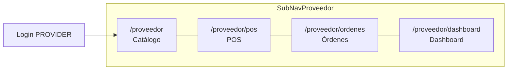
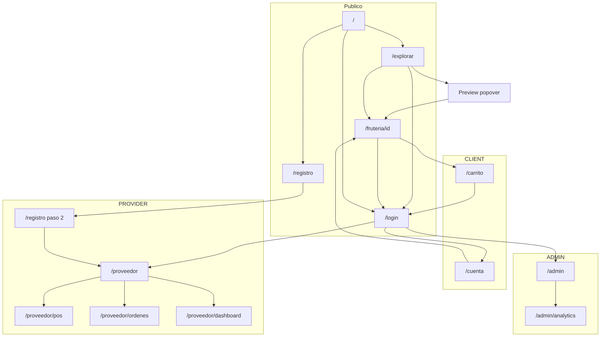

# Arquitectura de Información — LaBorregaMarket v0.9.0

> **Agente:** UX/UI Designer  
> **Fecha:** 25/08/2026  
> **Versión diseño:** 0.9.0  
> **Changelog Fase 9:** `/explorar` — preview in-card; typeahead header (`q`+geo); card distancia+ETA; chips Mayoreo/Domicilio; chrome una barra `md+`; mapa +10–20%. Snapshot F8: `historial/information-architecture-v0.8.3.md`.  
> **Changelog Fase 8:** `/explorar` — LocationChip (dónde) + ExploreCount (cuántas) + overlay radio 0.5–10 (hasta dónde); mapa México; preview hover/long-press anclado a la card. Snapshot F7: `historial/information-architecture-v0.7.1.md`.  
> **Changelog Fase 7:** `/explorar` mapa-primero (móvil arriba); pan ≠ `radiusKm`; default SN o last-used servidor; copy `meta.total`; preview sheet + ancla `#resenas`; `q` unión producto; login SessionPersistBanner.  
> **Changelog Fase 6:** `/proveedor/dashboard` — switcher Resumen | Reportes (día/mes/año, print + PDF); `/explorar` — círculo siempre visible, BrandLoader al refetch. **GEO zoom↔radio superado** por `CO-F7-001`.  
> **Changelog Fase 5:** `/explorar` Leaflet + OSM (revoca Google Maps JS); CTA ubicación en banner; radio overlay pie de mapa; barra compacta favoritas; config colores en `/proveedor`; toggle Activo/Inactivo = visibilidad de canal (no stock); tema CSS scoped a sesión PROVIDER.  
> **Changelog Fase 4:** Google Maps + radio + favoritas en `/explorar`; `/admin/analytics`; reseñas en cuenta y detalle; ETA y fulfillment en `/carrito`; báscula en POS.  
> **Changelog Fase 3:** Rutas `/carrito`, `/proveedor/pos`, `/proveedor/ordenes`, `/proveedor/dashboard`; SubNavProveedor; jerarquía F3; CTAs Encargar / Confirmar / Cobrar.

---

## 1. Visión general

LaBorregaMarket organiza la información en **tres capas de acceso**:

| Capa | Acceso | Descripción |
|------|--------|-------------|
| **Pública** | Sin sesión | Descubrimiento de fruterías, landing, auth |
| **Autenticada por rol** | JWT cookie | Paneles, carrito, POS y áreas restringidas por `CLIENT`, `PROVIDER`, `ADMIN` |
| **Transversal** | Header global | Navegación, búsqueda, menú de usuario |

---

## 2. Mapa de rutas por rol

### Rutas públicas

| Ruta | Propósito | CTA principal |
|------|-----------|---------------|
| `/` | Landing — propuesta de valor | "Explorar fruterías" |
| `/explorar` | Mapa Leaflet/OSM primero + chrome una barra + círculo 0.5–10 km (pan ≠ radio, viewport MX) + lista ≤20 + preview in-card + typeahead | Clic/tap corto card → detalle; hover/long-press → preview in-card |
| `/fruteria/[id]` | Detalle negocio + productos + encargo + reseñas | **Encargar** (F3); contacto secundario (F2) |
| `/login` | Autenticación | "Ingresar" |
| `/registro` | Alta de cuenta CLIENT o PROVIDER | "Crear cuenta" |

### Rutas CLIENT (`María`)

| Ruta | Propósito | CTA principal |
|------|-----------|---------------|
| `/cuenta` | Perfil, **direcciones favoritas** (Should list), historial pedidos, **calificar** | "Guardar cambios" / Calificar pedido |
| `/carrito` | Revisión ítems + ETA + confirmar (delivery Should) | **Confirmar pedido** |
| `/explorar` | Descubrimiento + radio + guardar favorita | Ver frutería / Guardar ubicación |
| `/fruteria/[id]` | Detalle (también público) | Encargar |

### Rutas PROVIDER (`Carlos`)

| Ruta | Propósito | CTA principal |
|------|-----------|---------------|
| `/registro` paso 2 | Wizard onboarding negocio | "Continuar" / "Finalizar" |
| `/proveedor` | Panel catálogo + **colores de marca** + config Google / tiempo preparación | Toggle Activo/Inactivo / Guardar colores |
| `/proveedor/pos` | Punto de venta mostrador + **báscula** | **Cobrar** |
| `/proveedor/ordenes` | Órdenes activas e historial reciente | Acción según estado |
| `/proveedor/dashboard` | KPIs hoy+7d (Resumen) y reportes día/mes/año (print + PDF) | Imprimir / Descargar PDF (solo vista Reportes; secondary) |

### Rutas ADMIN (operador)

| Ruta | Propósito | CTA principal |
|------|-----------|---------------|
| `/admin` | Curación catálogos, verificación, bitácora | Tabs de módulo |
| `/admin/analytics` | Analítica de plataforma (GMV, split, cancelación) | Periodo Hoy/7d/30d |

---

## 3. SubNavProveedor — hub de operaciones

Navegación secundaria fija bajo el header autenticado PROVIDER. Reemplaza el acceso único a `/proveedor` como destino post-login.



| Tab | Ruta | Rol en flujo |
|-----|------|--------------|
| Catálogo | `/proveedor` | Precios, toggle Activo/Inactivo, colores de marca |
| POS | `/proveedor/pos` | Venta rápida mostrador |
| Órdenes | `/proveedor/ordenes` | Fulfillment pedidos online + POS |
| Dashboard | `/proveedor/dashboard` | Métricas ventas + reportes calendario (tabs locales Resumen \| Reportes) |

---

## 4. Diagrama de navegación global (Fase 9)



---

## 5. Header — variantes de navegación

### Header público (sin sesión)

| Zona | Elementos |
|------|-----------|
| Izquierda | Logo 🍊 LaBorregaMarket → `/` |
| Centro | Pill búsqueda "Fruterías en tu zona" (expandible) |
| Derecha | "Registra tu frutería" → `/registro?role=provider`, icono idioma (placeholder), menú usuario → `/login` |

### Header autenticado — CLIENT

| Zona | Elementos |
|------|-----------|
| Izquierda | Logo → `/` |
| Centro | Pill búsqueda → typeahead en `/explorar`; otras rutas → `/explorar?q=` |
| Derecha | Icono carrito → `/carrito` (badge contador si ítems), Avatar + nombre, menú: Explorar, Mi cuenta, Cerrar sesión |

### Header autenticado — PROVIDER

| Zona | Elementos |
|------|-----------|
| Izquierda | Logo → `/` |
| Centro | Pill búsqueda (opcional, redirige explorar) |
| Derecha | Avatar + nombre negocio, menú: Mi panel, Explorar (preview), Cerrar sesión |
| Debajo header | **SubNavProveedor** (Catálogo · POS · Órdenes · Dashboard) |

### Header autenticado — ADMIN

| Zona | Elementos |
|------|-----------|
| Izquierda | Logo → `/` |
| Centro | — (sin búsqueda en MVP) |
| Derecha | Avatar + "Admin", menú: Panel admin, Analítica, Explorar, Cerrar sesión |

---

## 6. Jerarquía de contenido por pantalla

### `/explorar`

```
Header (ruta /explorar)
└── ExploreTypeahead (q≥2 → GET providers limit=10; filas cover+nombre; tacha limpia)
└── ExploreChromeF9 — UNA barra ≥md (chips + GPS + LocationChip + count)
    ├── FilterBarF9: Verificado, Frutas/Verduras/Agrícola, Mayoreo, A domicilio
    │                 (sin Orgánico ni «Filtros»; URL offersWholesale / offersDelivery)
    ├── CTA **Usar mi ubicación**
    ├── LocationChip + panel (F8 intacto)
    └── ExploreCount "N fruterías a R km|m"
└── Errores / hints debajo de la barra (no inflan la fila)
└── Mapa Leaflet + OSM PRIMERO (móvil h-420px; desktop min(520px,52vh))
    ├── Pin + círculo Haversine siempre visible si hay coords
    ├── Markers icono sin label permanente + tooltip
    ├── maxBounds México + minZoom 5
    ├── Attribution OSM
    └── RadiusOverlayF8 500 m–10 km (pan NO sincroniza)
└── Lista debajo (máx. 20) — alternativa a11y
    ├── BrandLoader loading 64px al refetch; empty 80px si total=0
    ├── Grid ProviderCard (distancia+ETA; sin minPrice visual; tap corto = detalle)
    └── Paginación (no resetea mapa)
└── ProviderPreviewInCard (US-EXPLORE-08; contenido US-EXPLORE-05)
```

Query shareable: `lat`, `lng`, `radiusKm`, `q`, `category`, `verified`, `offersWholesale`, `offersDelivery`, `page`.

Jerarquía: **typeahead (qué) + chrome (dónde/filtros/cuántas) + overlay (hasta dónde) + mapa**. Default centro: San Nicolás `25.7475, -100.2830` + 10 km, o last-used API.

### `/fruteria/[id]` (Fase 4 + ancla F7)

```
Header
└── Hero negocio (nombre, verificado, RatingStars reales o "Sin reseñas todavía")
└── Grid 2 cols desktop
    ├── Info (dirección, teléfono, horario)
    └── Mapa mini / ubicación
└── Sección productos (tabla con QuantityStepper por fila)
└── CTA sticky mobile: Encargar (dominante) + ContactCTA secundario (Llamar / WhatsApp — D-F3-7)
└── **`#resenas`** Reseñas nativas (ReviewCard) + enlace Google si googleReviewsEnabled
```

### `/carrito` (Fase 4 delta)

```
Header CLIENT (o auth gate si sin sesión)
└── Título "Tu pedido" + nombre frutería
└── Lista TicketLine (ítems, stepper, subtotales)
└── FulfillmentToggle (si offersDelivery) + FavoriteAddressSelect
└── Resumen + EtaChip
└── CTA sticky: Confirmar pedido → POST orden PENDING
```

### `/cuenta` (actualizado F4)

```
Header autenticado CLIENT
└── Sección perfil (nombre, email, teléfono)
└── Sección pedidos (OrderCard — Calificar si Entregado; copy En camino si DELIVERY)
└── CTA "Guardar cambios" (perfil)
```

### `/proveedor`

```
Header + SubNavProveedor (Catálogo activo)
└── Título panel + nombre negocio
└── Media F2 (logo/portada)
└── Colores de marca (primario + secundario + preview contraste) — F5
└── Tabla productos globales (precio, toggle **Activo / Inactivo** — visibilidad de canal, no stock)
└── Configuración F4: Google Maps (verificado / bloqueado informativo) + preparationTimeMinutes
```

### `/proveedor/pos` (F3 + báscula F4)

```
Header + SubNavProveedor (POS activo)
└── Split POS
    ├── Catálogo grid (solo productos **activos** + QuickSaleBadge)
    │   └── Empty F5: "No hay productos activos" + Ir a Catálogo
    └── Panel ticket (ScaleStatusBadge, TicketLine, total, PaymentMethodSelector, Cobrar)
```

### `/proveedor/ordenes` (nuevo F3)

```
Header + SubNavProveedor (Órdenes activo)
└── Tabs: Activas | Historial
└── Lista OrderCard con OrderStatusBadge + OriginBadge
└── Acciones por estado (Confirmar → Listo para recoger → Entregar)
```

### `/proveedor/dashboard` (F3 + reportes F6)

```
Header + SubNavProveedor (Dashboard activo)
└── DashboardViewSwitcher: Resumen | Reportes
    ├── Resumen (default): Grid KpiCard hoy+7d · BarChart 7d · top venta rápida (F3)
    └── Reportes (`?view=reportes`):
        ├── GrainSelector + ReportPeriodPicker (TZ Monterrey)
        ├── DocumentActions: Imprimir · Descargar PDF (secondary)
        ├── KpiCard GMV / ticket / órdenes + split Encargar vs POS
        ├── BarChart serie (mes→días, año→meses; día sin chart)
        └── Tabla top 5 periodo (incl. venta rápida)
```

Sin ruta `/proveedor/reportes`. Distinto de `/admin/analytics`.

### `/admin`

```
Header autenticado ADMIN
└── Tabs: Catálogos | Proveedores | Bitácora | Analítica
└── Contenido tab activo
```

### `/admin/analytics` (nuevo F4)

```
Header ADMIN + tab Analítica
└── PeriodToggle (Hoy | 7d | 30d)
└── Grid KpiCardAdmin (GMV, órdenes, proveedores activos, cancelación)
└── OriginSplitBar Marketplace vs POS
└── Tabla top 5 fruterías
```

---

## 7. CTAs dominantes por pantalla

| Pantalla | CTA dominante | CTA secundario |
|----------|---------------|----------------|
| `/login` | Ingresar | Crear cuenta |
| `/registro` paso 1 | Crear cuenta | Ya tengo cuenta |
| `/registro` paso 2 | Finalizar registro | Atrás |
| `/explorar` | Clic/tap corto → detalle; preview **Ver frutería** | Usar mi ubicación / Guardar ubicación / Ampliar radio |
| `/fruteria/[id]` | **Encargar** | Llamar / WhatsApp (F2, D-F3-7) |
| `/carrito` | **Confirmar pedido** | Seguir comprando |
| `/cuenta` | Guardar cambios / **Calificar pedido** (card) | Ver detalle |
| `/proveedor` | Guardar colores / toggle Activo | Guardar vínculo Google |
| `/proveedor/pos` | **Cobrar** | Conectar báscula / Vaciar ticket |
| `/proveedor/ordenes` | (contextual) Confirmar / Marcar listo o En camino / Entregar | — |
| `/proveedor/dashboard` | Imprimir / Descargar PDF (vista Reportes) | — (Resumen F3 informativo) |
| `/admin` | (contextual por tab) | — |
| `/admin/analytics` | Periodo (Hoy/7d/30d) | — |

**Regla:** Un solo CTA visualmente dominante por pantalla (color `--brand`, tamaño mayor).

**F6 dashboard:** Imprimir / Descargar PDF son Button **Secondary** (acciones de documento). No hay primary de cobro en Dashboard.

**Decisión D-F3-7:** El flujo de contacto Fase 2 (Llamar, WhatsApp, toast notify) se **preserva** en `/fruteria/[id]` como acciones secundarias. Encargar no reemplaza `tel:` ni `POST /api/providers/[id]/contact`.

---

## 8. Referencias

| Documento | Ruta relativa |
|-----------|---------------|
| Design tokens | `comun/design-tokens.md` v0.8.3 |
| Handoff F8 | `fase-8/handoff-frontend-fase-8.md` |
| User flows F8 | `fase-8/user-flows/UF-*.md` |
| Wireframes F8 | `fase-8/wireframes/WF-*.md` |
| Handoff F7 (solo lectura) | `fase-7/handoff-frontend-fase-7.md` |
| User flows F7 | `fase-7/user-flows/UF-*.md` |
| Wireframes F7 | `fase-7/wireframes/WF-*.md` |
| Handoff F6 (congelado) | `fase-6/handoff-frontend-fase-6.md` |
| Handoff F5 | `fase-5/handoff-frontend.md` |
| User flows F5 | `fase-5/user-flows/UF-*.md` |
| Wireframes F5 | `fase-5/wireframes/WF-*.md` |
| Handoff F4 | `fase-4/handoff-frontend.md` |
| User flows F4 | `fase-4/user-flows/UF-*.md` |
| Wireframes F4 | `fase-4/wireframes/WF-*.md` |
| Handoff F3 | `fase-3/handoff-frontend.md` |
| User flows F1–F3 | `fase-{N}/user-flows/UF-*.md` |
