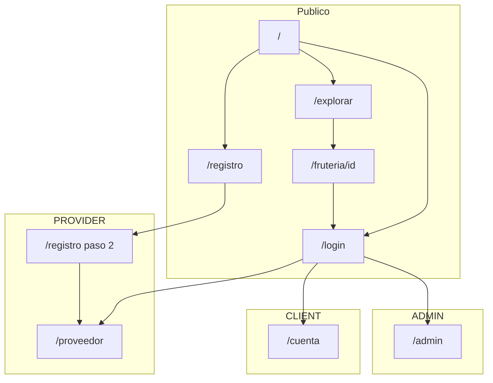

# Arquitectura de Información — LaBorregaMarket v0.1.0

> **Agente:** UX/UI Designer  
> **Fecha:** 05/08/2026  
> **Versión diseño:** 0.1.0

---

## 1. Visión general

LaBorregaMarket organiza la información en **tres capas de acceso**:

| Capa | Acceso | Descripción |
|------|--------|-------------|
| **Pública** | Sin sesión | Descubrimiento de fruterías, landing, auth |
| **Autenticada por rol** | JWT cookie | Paneles y áreas restringidas por `CLIENT`, `PROVIDER`, `ADMIN` |
| **Transversal** | Header global | Navegación, búsqueda, menú de usuario |

---

## 2. Mapa de rutas por rol

### Rutas públicas

| Ruta | Propósito | CTA principal |
|------|-----------|---------------|
| `/` | Landing — propuesta de valor | "Explorar fruterías" |
| `/explorar` | Mapa + tarjetas de fruterías | Clic en tarjeta → detalle |
| `/fruteria/[id]` | Detalle negocio + productos + contacto | "Llamar" (`tel:`) |
| `/login` | Autenticación | "Ingresar" |
| `/registro` | Alta de cuenta CLIENT o PROVIDER | "Crear cuenta" |

### Rutas CLIENT (`María`)

| Ruta | Propósito | CTA principal |
|------|-----------|---------------|
| `/cuenta` | Perfil y preferencias | "Guardar cambios" |
| `/explorar` | Descubrimiento (también público) | Ver frutería |
| `/fruteria/[id]` | Detalle (también público) | Contactar |

### Rutas PROVIDER (`Carlos`)

| Ruta | Propósito | CTA principal |
|------|-----------|---------------|
| `/registro` paso 2 | Wizard onboarding negocio | "Continuar" / "Finalizar" |
| `/proveedor` | Panel catálogo — activar productos, precios | Toggle disponibilidad |

### Rutas ADMIN (operador)

| Ruta | Propósito | CTA principal |
|------|-----------|---------------|
| `/admin` | Curación catálogos, verificación, bitácora | Tabs de módulo |

---

## 3. Diagrama de navegación global



---

## 4. Header — variantes de navegación

### Header público (sin sesión)

| Zona | Elementos |
|------|-----------|
| Izquierda | Logo 🍊 LaBorregaMarket → `/` |
| Centro | Pill búsqueda "Fruterías en tu zona" (expandible) |
| Derecha | "Registra tu frutería" → `/registro?role=provider`, icono idioma (placeholder), menú usuario → `/login` |

### Header autenticado — CLIENT

| Zona | Elementos |
|------|-----------|
| Izquierda | Logo → `/` |
| Centro | Pill búsqueda (funcional → `/explorar?q=`) |
| Derecha | Avatar + nombre, menú: Explorar, Mi cuenta, Cerrar sesión |

### Header autenticado — PROVIDER

| Zona | Elementos |
|------|-----------|
| Izquierda | Logo → `/` |
| Centro | Pill búsqueda (opcional, redirige explorar) |
| Derecha | Avatar + nombre negocio, menú: Mi panel, Explorar (preview), Cerrar sesión |

### Header autenticado — ADMIN

| Zona | Elementos |
|------|-----------|
| Izquierda | Logo → `/` |
| Centro | — (sin búsqueda en MVP) |
| Derecha | Avatar + "Admin", menú: Panel admin, Explorar, Cerrar sesión |

---

## 5. Jerarquía de contenido por pantalla

### `/explorar`

```
Header
└── FilterBar (chips: verificado, frutas, verduras…)
└── Split view
    ├── Lista (55–58% desktop)
    │   ├── Contador resultados
    │   ├── Grid ProviderCard (1/2/3 cols)
    │   └── Paginación
    └── Mapa Leaflet (sticky desktop, stack mobile)
```

### `/fruteria/[id]`

```
Header
└── Hero negocio (nombre, verificado, rating placeholder)
└── Grid 2 cols desktop
    ├── Info (dirección, teléfono, horario placeholder)
    └── Mapa mini / ubicación
└── Sección productos (tabla o cards con precio)
└── CTA sticky mobile: "Llamar"
```

### `/proveedor`

```
Header autenticado PROVIDER
└── Título panel + nombre negocio
└── [Estado sin Provider] → EmptyState + CTA wizard
└── [Estado con Provider] → Tabla productos globales
    ├── Columna: producto, categoría, precio (editable), toggle activo
    └── Acción guardar por fila o batch
```

### `/cuenta`

```
Header autenticado CLIENT
└── Sección perfil (nombre, email, teléfono)
└── Sección pedidos (placeholder Fase 2)
└── CTA "Guardar cambios"
```

### `/admin`

```
Header autenticado ADMIN
└── Tabs: Catálogos | Proveedores | Bitácora
└── Contenido tab activo (read-only JSON en MVP catálogos)
```

---

## 6. CTAs dominantes por pantalla

| Pantalla | CTA dominante | CTA secundario |
|----------|---------------|----------------|
| `/login` | Ingresar | Crear cuenta |
| `/registro` paso 1 | Crear cuenta | Ya tengo cuenta |
| `/registro` paso 2 | Finalizar registro | Atrás |
| `/explorar` | (implícito) Clic tarjeta | Filtros |
| `/fruteria/[id]` | Llamar | Volver a explorar |
| `/cuenta` | Guardar cambios | — |
| `/proveedor` | Activar producto / Guardar precio | Completar registro (si sin Provider) |
| `/admin` | (contextual por tab) | — |

**Regla:** Un solo CTA visualmente dominante por pantalla (color `--brand`, tamaño mayor).

---

## 7. Referencias

| Documento | Ruta relativa |
|-----------|---------------|
| User flows AUTH | `user-flows/UF-AUTH-*.md` |
| User flows CLIENT | `user-flows/UF-CLIENT-*.md` |
| User flows PROVIDER | `user-flows/UF-PROVIDER-*.md` |
| User flows ADMIN | `user-flows/UF-ADMIN-*.md` |
| Wireframes | `wireframes/WF-*.md` |
| Design tokens | `design-tokens.md` |
