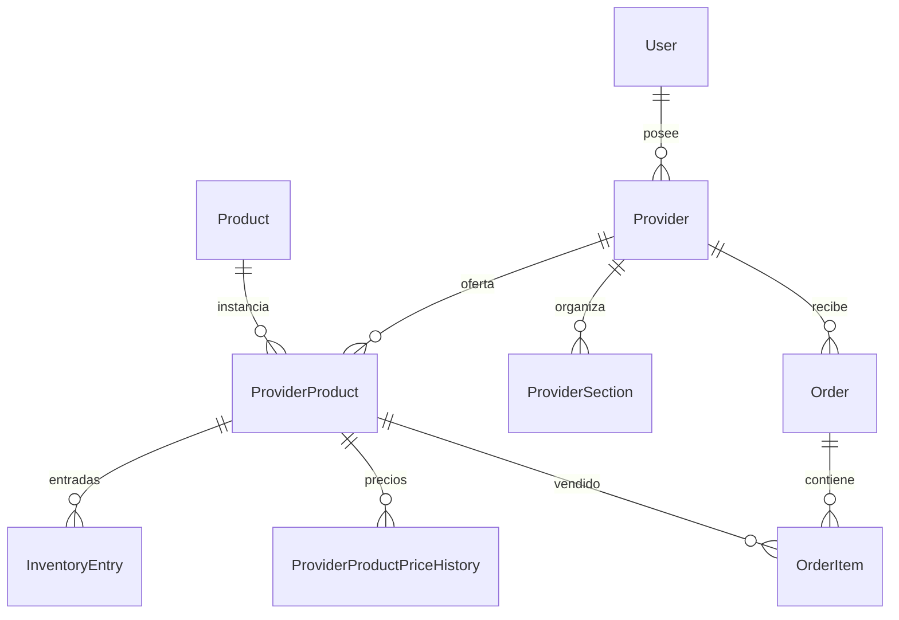
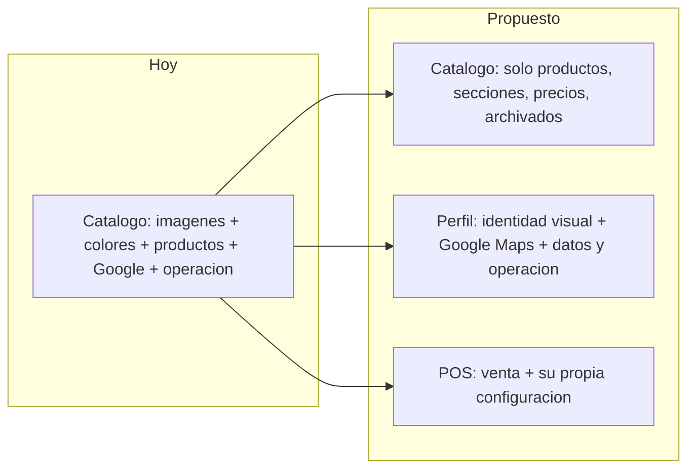
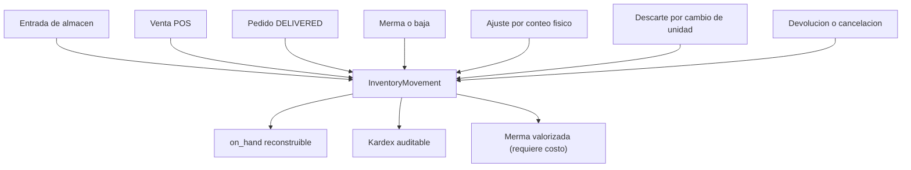
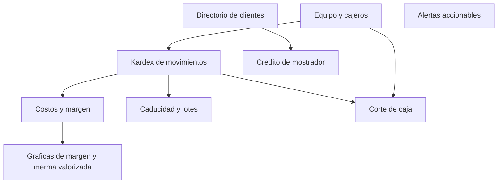
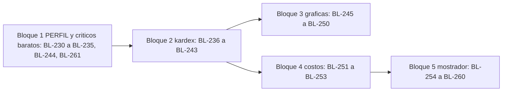

# Documento de Mejora — Panel Proveedor LaBorregaMarket

> **Tipo:** Diagnóstico de orquestación (no es entregable de fase)
> **Fecha:** 17/09/2026
> **Autor:** Orquestador OrquestIA-MX
> **Versión de la app analizada:** 0.13.0 (Fase 13 cerrada documentalmente 16/09)
> **Alcance de análisis:** módulos del usuario `PROVIDER` en `C:\Users\PC GAMER\LaBorregaMarket`
> **Downstream:** Discovery del Product Manager → UX/UI + Arquitecto

---

## 0. Naturaleza y límites de este documento

Este documento **no promueve fase ni sustituye el Discovery del PM**. Es un diagnóstico de orquestación que vive junto a [`PROCESO.md`](./PROCESO.md) y cumple una función concreta: entregar al PM un inventario verificado del estado actual del panel proveedor, las inconsistencias detectadas en código, y una propuesta priorizada que el PM pueda convertir en PRD y User Stories.

| Declaración | Estado |
|---|---|
| Abre `fase-14/` | **No.** El `STATUS.md` del PM declara explícitamente «No abrir fase 14» |
| Modifica los siete `STATUS.md` | **No** |
| Modifica el repo de la app (`LaBorregaMarket`) | **No.** Ni código, ni migraciones, ni PR |
| Emite User Stories con Given-When-Then | **No.** Es responsabilidad del PM en su Discovery |
| Asigna IDs `BL-*` nuevos | **Sí**, desde `BL-230` (el último usado en el backlog es `BL-224`) |
| Reabre fases cerradas (F6–F13) | **No.** Las referencias a fases previas son solo lectura |

Los IDs `BL-230`+ propuestos aquí son **candidatos**. Solo el PM los promueve a Must/Should/Could en un PRD de fase.

---

## Inputs Utilizados

**Repo de la app** (`C:\Users\PC GAMER\LaBorregaMarket`, rama `feat/f13-archivo-oferta-unidad`):

- `PRODUCT.md` — visión de producto v0.13.0, roadmap F1–F14
- `prisma/schema.prisma` — contrato de datos (11 migraciones, de `20260805183000` a `20260916180000`)
- `src/app/proveedor/**` — rutas del panel
- `src/components/provider/**`, `src/components/inventory/**`, `src/components/pos/**`
- `src/app/api/provider/**` — 22 rutas de API del proveedor
- `src/lib/services/**` — `inventory`, `pos`, `order`, `dashboard`, `inventory-report`, `provider`, `local-product`, `media`
- `src/lib/validators/**` — `inventory`, `report`, `provider-settings`, `catalog-f10`, `catalog-f13`
- `package.json` — dependencias (sin librería de gráficas)

**Repo de orquestación** (este workspace):

- [`comun/PROCESO.md`](./PROCESO.md) — cadena canónica
- `Administrador de producto/Product Manager/outputs/laborregamarket/STATUS.md` — fase activa 13, cerrada
- `Administrador de producto/Product Manager/outputs/laborregamarket/comun/backlog.md` — backlog MoSCoW, `BL-001` a `BL-224`
- Reglas `00-validacion-cruzada-global`, `02-calidad-output`, `04-control-fase`, `05-especifico-rol`, `06-orquestador`

**Nota de método:** el repo de la app **no** tiene grafo Graphify (`graphify-out/graph.json` inexistente ahí), por lo que la exploración fue directa sobre archivos, conforme a la excepción 2 de `graphify.mdc`. El grafo de este workspace sí se consultó para ubicar STATUS y fase activa.

---

## 1. Mapa del estado actual

### 1.1 Navegación del panel

Las pestañas se definen en [`SubNavProveedor.tsx`](file:///C:/Users/PC%20GAMER/LaBorregaMarket/src/components/provider/SubNavProveedor.tsx):

```10:16:C:\Users\PC GAMER\LaBorregaMarket\src\components\provider\SubNavProveedor.tsx
const TABS = [
  { href: "/proveedor/inventario", label: "Inventario" },
  { href: "/proveedor", label: "Catálogo" },
  { href: "/proveedor/pos", label: "POS" },
  { href: "/proveedor/ordenes", label: "Órdenes" },
  { href: "/proveedor/dashboard", label: "Ventas" },
] as const;
```

«Reportes generales» se añade condicionalmente cuando el usuario tiene más de una frutería (`showGlobalReports` desde `useProviderScope`).

El layout envuelve todo en `ProviderPanelBody`, que fuerza remount con `key={activeProviderId}` al cambiar de sucursal — mecanismo de aislamiento de F11.

### 1.2 Responsabilidad declarada vs real

| Pestaña | Ruta | Componente raíz | Responsabilidad declarada | Responsabilidad **real** |
|---|---|---|---|---|
| Inventario | `/proveedor/inventario` | `InventoryPageClient` | Existencias por sucursal | Coincide. Tabla on-hand + capacidad + alerta + reserva; entrada manual y ficha de SKU |
| **Catálogo** | `/proveedor` | `ProveedorPageClient` | «Activa el catálogo global o agrega productos solo de tu frutería» | **Divergente.** Además del catálogo: imágenes del negocio, colores de marca, toggle de fotos del POS, tiempo de preparación, entrega a domicilio y configuración de Google |
| POS | `/proveedor/pos` | `PosPageClient` | Venta de mostrador | Coincide. Su configuración (`posShowImages`) vive en Catálogo |
| Órdenes | `/proveedor/ordenes` | `OrdenesPageClient` | Pedidos y transiciones | Coincide. Tabs internos por estado |
| Ventas | `/proveedor/dashboard` | `DashboardPageClient` | KPIs y reportes | Coincide, con dos vistas internas: Resumen y Reportes |
| Reportes generales | `/proveedor/reportes-generales` | `GlobalReportsPageClient` | Consolidado multi-sucursal | Coincide parcialmente: **no pinta** las series ni los productos que la API sí devuelve |

### 1.3 Composición actual de la pestaña Catálogo

Cuatro bloques heterogéneos apilados verticalmente en [`ProveedorPageClient.tsx`](file:///C:/Users/PC%20GAMER/LaBorregaMarket/src/app/proveedor/ProveedorPageClient.tsx):

| Orden | Bloque | Componente | Línea | Naturaleza |
|---|---|---|---|---|
| A | «Imagen del negocio» (logo + portada) | 2× `MediaUpload` | 125–158 | Identidad visual |
| B | «Colores de tu marca» | `BrandColorPicker` | 160 | Identidad visual |
| C | Catálogo real (secciones, productos, precios, archivados) | `ProviderCatalogF10` | 162 | **Producto** |
| D | «Operación y Google» | `ProviderSettingsForm` | 200 | Configuración de negocio |

Solo el bloque C corresponde al nombre de la pestaña. Los bloques A, B y D son configuración del negocio conviviendo con la gestión de inventario de oferta.

### 1.4 Superficie de API del proveedor

22 rutas bajo `/api/provider/**`. Agrupadas por dominio:

| Dominio | Endpoints |
|---|---|
| Identidad y config | `GET/PATCH /api/provider/me`, `POST /api/provider/media`, `GET /api/provider/mine`, `POST /api/provider/active` |
| Catálogo | `GET/PATCH /api/provider/products`, `/api/provider/local-products[/id]`, `/api/provider/products/by-product/[productId]{,/price,/archive,/restore}`, `/api/provider/products/[providerProductId]{/image,/price-history}` |
| Secciones | `GET/POST /api/provider/sections`, `PATCH/DELETE /api/provider/sections/[id]`, `PATCH /api/provider/sections/reorder` |
| Inventario | `GET /api/provider/inventory`, `PATCH /api/provider/inventory/[providerProductId]`, `POST /api/provider/inventory/[providerProductId]/entries` |
| Ventas y reportes | `GET /api/provider/dashboard`, `/api/provider/reports`, `/api/provider/reports/inventory`, `/api/provider/reports/global`, `/api/provider/reports/global/inventory`, `/api/provider/reports.pdf` |
| Operación | `GET/PATCH /api/provider/orders[/id]`, `POST /api/provider/pos/sales` |

### 1.5 Modelo de datos relevante

Núcleo del panel proveedor:



Puntos estructurales que condicionan toda la propuesta:

- `ProviderProduct.onHand` es `Decimal(12,3)` y es **la única fuente de verdad** del saldo. `stock Int?` quedó deprecado en F12 (ADR-036) y sigue en el schema.
- `InventoryEntry` registra **solo entradas positivas**: `quantity`, `receiveAs`, `appliedDelta`, `createdAt`. Sin tipo de movimiento, sin motivo, sin usuario.
- `Order` cubre marketplace y POS mediante `source`. En POS, `clientId` es nulo y solo hay `customerName` como texto libre.
- **No existe** ningún campo de costo de compra en el modelo.
- **No existe** atribución de quién registró una venta o un movimiento (`Order` no tiene `createdByUserId`).
- `SystemModule` no incluye un valor `INVENTORY`, por lo que los movimientos de stock no son auditables por módulo.

---

## 2. Reorganización de la navegación

### 2.1 Problema

La pestaña Catálogo acumula cuatro responsabilidades distintas (sección 1.3). El costo real de esto no es estético:

1. **Frecuencia de uso invertida.** El catálogo se toca a diario (precios, disponibilidad); el logo y los colores se configuran una vez. Hoy conviven con el mismo peso visual, y el usuario debe pasar por la configuración para llegar al trabajo diario.
2. **Google Maps sepultado.** La configuración que determina si la vitrina muestra reseñas está al final de una página larga, bajo el título «Operación y Google».
3. **Ningún lugar natural para el perfil.** No hay una pestaña donde el proveedor gestione la identidad y los datos de su negocio, así que los campos que faltan (sección 2.3) no tienen dónde aterrizar.

### 2.2 Estructura propuesta



Navegación resultante:

| Pestaña | Ruta | Cambio |
|---|---|---|
| Inventario | `/proveedor/inventario` | Gana sub-pestaña «Movimientos» (sección 3) |
| Catálogo | `/proveedor` | **Se reduce** a productos: secciones, altas locales, precios, unidades, archivados |
| POS | `/proveedor/pos` | **Recibe** el toggle de fotos de card |
| Órdenes | `/proveedor/ordenes` | Sin cambio |
| Ventas | `/proveedor/dashboard` | Gana dashboard de gráficas (sección 4) |
| **Perfil** | `/proveedor/perfil` | **Nueva.** Identidad visual, Google Maps, datos y operación del negocio |
| Reportes generales | `/proveedor/reportes-generales` | Pinta las series que ya recibe (sección 4) |

Sobre el orden de las pestañas: Perfil es de uso esporádico, por lo que corresponde al extremo derecho de la barra, después de Ventas. La posición exacta y el ícono son decisión de UX.

### 2.3 Contenido de la pestaña Perfil

**Bloque 1 — Identidad visual.** Migración directa de componentes existentes, sin cambio de contrato:

| Elemento | Componente a mover | Endpoint |
|---|---|---|
| Logo | `MediaUpload` variant `logo` | `POST /api/provider/media` → `Provider.logoUrl` |
| Portada | `MediaUpload` variant `cover` | `POST /api/provider/media` → `Provider.coverUrl` |
| Colores de marca | `BrandColorPicker` | `PATCH /api/provider/me` |

**Bloque 2 — Google Maps.** Extracción del bloque «Google» de `ProviderSettingsForm`, con el gate de verificación intacto: hoy `locked = googleReviewsLocked || isVerified === false` y el backend lanza `GoogleReviewsLockedError` si el negocio no está verificado. Al aislarlo en su propio sub-módulo gana espacio para lo que hoy no tiene: una previsualización del mapa o un validador visible de la URL. Contrato sin cambio (`googlePlaceId`, `googleMapsUrl`, `googleReviewsEnabled`, validados por `isValidGooglePlaceId` / `isValidGoogleMapsUrl`).

**Bloque 3 — Datos y operación del negocio.** Aquí está el hallazgo de mayor impacto funcional del análisis.

### 2.4 Hallazgo: los datos del negocio no se pueden editar nunca

Verificado en dos capas independientes:

`patchProviderSettingsSchema` es `.strict()` y su lista de campos aceptados **no incluye** los datos del negocio:

```122:161:C:\Users\PC GAMER\LaBorregaMarket\src\lib\validators\provider-settings.ts
export const patchProviderSettingsSchema = z
  .object({
    preparationTimeMinutes: z.number(...).optional(),
    offersDelivery: z.boolean().optional(),
    googlePlaceId: ...,
    googleMapsUrl: ...,
    googleReviewsEnabled: z.boolean().optional(),
    primaryColor: hexOrNull.optional(),
    secondaryColor: hexOrNull.optional(),
    whatsappEnabled: z.boolean().optional(),
    acceptsCardAtStore: z.boolean().optional(),
    offersWholesale: z.boolean().optional(),
    offersRetail: z.boolean().optional(),
    posShowImages: ...,
    openingHours: openingHoursSchema,
  })
  .strict()
```

`patchAdminProviderSchema`, en el mismo archivo, solo acepta `isVerified`, `isActive`, `offersWholesale`, `offersDelivery` y el par de colores.

Sin embargo `serializeProviderSettings` **sí devuelve** todos esos datos en el GET (`provider.service.ts` 531–571): `businessName`, `address`, `city`, `latitude`, `longitude`, `phone`, `description`.

**Consecuencia:** `businessName`, `address`, `city`, `latitude`, `longitude`, `phone` y `description` solo se escriben una vez, en `POST /api/providers` con `createProviderSchema` durante el onboarding. Después de eso **ni el proveedor ni el administrador** pueden corregirlos por API. Una frutería que se muda, que registró mal el teléfono o que puso un pin de mapa equivocado queda con el dato incorrecto de forma permanente, y ese dato alimenta Explorar, el cálculo de distancia Haversine y el ETA.

Esto no es deuda cosmética: es un defecto de producto con impacto directo en el cliente final. Requiere ampliar el PATCH (backend) además de la UI.

### 2.5 Hallazgo: campos aceptados por la API sin ningún control en la UI

Cinco campos que el backend ya valida, persiste y serializa, pero que ningún componente del panel expone:

| Campo | Tipo | Validación existente | Dónde impacta |
|---|---|---|---|
| `openingHours` | `Json?` | `openingHoursSchema` completo: 7 días, `HH:mm` 24h, `open < close`, día único | `HoursTable` en Explorar y en la vitrina |
| `whatsappEnabled` | `Boolean` | `z.boolean()` | `ProviderCapabilities` en Explorar; notificaciones WhatsApp |
| `acceptsCardAtStore` | `Boolean` | `z.boolean()` | `ProviderCapabilities` en Explorar |
| `offersWholesale` | `Boolean` | `z.boolean()` | Filtro «Mayoreo» de Explorar (`BL-163`, F9) |
| `offersRetail` | `Boolean` | `z.boolean()` | `ProviderCapabilities` en Explorar |

El caso de `openingHours` es el más llamativo: existe un validador Zod de 55 líneas con reglas de negocio finas y un componente `HoursTable` que lo consume del lado del cliente, pero **no hay forma de capturar el horario**. El valor solo puede llegar por seed o por escritura directa a la base de datos.

`offersWholesale` es peor que un campo vacío: es un filtro que el cliente **usa** en Explorar y que el proveedor no puede activar por sí mismo — solo un administrador vía `patchAdminProviderSchema`.

### 2.6 Catálogo después de la reducción

Se queda con lo que corresponde a su nombre, todo ya implementado en `ProviderCatalogF10`:

- Toolbar de alta de producto y nueva sección
- Secciones (`ProviderSection`): crear, renombrar, reordenar, eliminar si está vacía (409 si tiene productos)
- Filas de producto: miniatura, `ScopeBadge` GLOBAL/LOCAL, precio inline, historial de precio, selector de sección, barra de capacidad, foto, disponibilidad, archivar
- `ProductFormDrawer` para alta y edición (unidad de oferta, factor de caja)
- `ArchivedTray`: bandeja «Eliminados de la vista» con restauración

**Se retira** de esta pestaña: logo, portada, colores y el bloque «Operación y Google» (→ Perfil), más el toggle `posShowImages` (→ POS, donde `PosImagesToggle` ya tiene su semántica natural; hoy el componente vive en la carpeta `inventory/` y se edita desde Catálogo, una triple incoherencia de ubicación).

### 2.7 Naturaleza del esfuerzo

La reorganización es **mayormente frontend**: crear la ruta `/proveedor/perfil`, mover cuatro componentes existentes, añadir la entrada al `SubNav`. No requiere contratos nuevos.

Las dos excepciones necesitan backend:

1. Ampliar `patchProviderSettingsSchema` con los datos del negocio (2.4), reutilizando `monterreyLatSchema` / `monterreyLngSchema` que ya existen en `validators/geo.ts`. Decisión abierta: si cambiar coordenadas debe requerir re-verificación del negocio, dado que `isVerified` es un gate de confianza.
2. Nada para los cinco campos de 2.5: el contrato ya los acepta; solo falta UI.

---

## 3. Módulo nuevo: movimientos de inventario (bajas y mermas)

### 3.1 Problema: el ledger está incompleto

`inventory_entries` **solo registra entradas positivas**. Las salidas mutan `on_hand` directamente sin dejar rastro.

Las entradas sí dejan fila, en una transacción correcta:

```266:281:C:\Users\PC GAMER\LaBorregaMarket\src\lib\services\inventory.service.ts
  const updated = await prisma.$transaction(async (tx) => {
    const entry = await tx.inventoryEntry.create({
      data: {
        providerProductId: row.id,
        quantity: qty,
        receiveAs: params.input.receiveAs ?? "CATALOG",
        appliedDelta: delta,
      },
    });
    const next = await tx.providerProduct.update({
      where: { id: row.id },
      data: { onHand: { increment: delta } },
      include: { product: true },
    });
    return { next, lastEntryId: entry.id };
  });
```

Las salidas, en cambio, solo decrementan:

```289:324:C:\Users\PC GAMER\LaBorregaMarket\src\lib\services\inventory.service.ts
export async function decrementOnHandForLines(
  tx: Tx,
  providerId: string,
  lines: Array<{ providerProductId, quantity, unitOfMeasure, productUnit? }>
) {
  // agrupa por providerProductId y convierte UoM a unidad de catálogo
  for (const [id, delta] of deltas) {
    if (delta.eq(0)) continue;
    await tx.providerProduct.update({
      where: { id },
      data: { onHand: { decrement: delta } },
    });
  }
}
```

Tres rutas de mutación sin registro alguno:

| Origen | Archivo | Rastro |
|---|---|---|
| Venta POS al cobrar | `pos.service.ts` → `decrementOnHandForLines` | Solo la `Order`; el movimiento de stock no se registra |
| Pedido marketplace al pasar a `DELIVERED` | `order.service.ts` → `decrementOnHandForLines` | Igual |
| Descarte por cambio de unidad o factor | `onHand: 0` en `product.service.ts:465`, `local-product.service.ts:266`, `inventory.service.ts:232` | **Ninguno.** El saldo se destruye sin traza |

El descarte es el caso más grave: `assertUnitFactorChangeAllowed` exige `confirmDiscard: true` del usuario, y luego el saldo simplemente desaparece. La UI es honesta al respecto (`UnitChangeConfirmDialog` dice «Esto no es una entrada de almacén»), pero no queda evidencia de cuánta mercancía se dio de baja ni por qué.

### 3.2 Consecuencias operativas

1. **No se puede auditar una diferencia.** Si el saldo no cuadra con el conteo físico, no hay forma de saber si fue venta, merma, error de captura o descarte por cambio de unidad.
2. **No se puede medir la merma**, que en fruta y verdura es el principal costo oculto del negocio. Hoy la merma se «registra» dejando que el saldo se desvíe.
3. **`on_hand` no es reconstruible.** Al ser un saldo mutable sin ledger completo, un dato corrupto no tiene forma de recalcularse.
4. **La cancelación post-entrega no revierte.** Cancelar un pedido que ya pasó por `DELIVERED` no restaura `on_hand`, y no hay registro que permita detectarlo.

### 3.3 Propuesta: kardex completo

Tabla unificada `InventoryMovement` que sustituye conceptualmente a `InventoryEntry`, con la invariante de que **toda** mutación de `on_hand` genera exactamente una fila:



Forma propuesta del modelo (el diseño formal corresponde al Arquitecto):

| Campo | Tipo | Propósito |
|---|---|---|
| `id` | `String` PK | — |
| `providerProductId` | `String` FK | SKU afectado |
| `movementType` | enum nuevo | `ENTRADA`, `VENTA_POS`, `ENTREGA_PEDIDO`, `MERMA`, `AJUSTE`, `DESCARTE_UNIDAD`, `DEVOLUCION` |
| `reason` | enum nullable | Para `MERMA`: `CADUCIDAD`, `DANO`, `ROBO`, `MUESTRA`, `OTRO` |
| `note` | `String?` | Texto libre del proveedor |
| `signedDelta` | `Decimal(12,3)` | Delta aplicado, **con signo** |
| `onHandAfter` | `Decimal(12,3)` | Saldo resultante, para auditar sin recalcular |
| `quantity` / `receiveAs` | `Decimal` / enum | Se conservan de `InventoryEntry` para entradas en caja |
| `createdByUserId` | `String?` FK | Quién lo registró |
| `referenceType` / `referenceId` | `String?` | Traza al `Order` o al cambio de oferta que lo originó |
| `createdAt` | `DateTime` | Índice compuesto con `providerProductId` |

**Migración:** `inventory_entries` se convierte en el subconjunto `movementType = ENTRADA` con `signedDelta = appliedDelta`. `createdByUserId` queda nulo en las filas históricas (no existe el dato) y `onHandAfter` tampoco es reconstruible hacia atrás — ambos deben admitir nulos para el histórico. Es una migración aditiva sin pérdida.

### 3.4 UI propuesta

Sub-pestaña «Movimientos» dentro de Inventario, junto al listado actual de existencias:

- **Registrar merma:** SKU, cantidad en unidad efectiva, motivo (enum) y nota. Simétrico a `StockEntrySheet`, que ya existe y valida `quantity > 0`.
- **Ajuste por conteo:** el proveedor captura el saldo real observado y el sistema calcula el `signedDelta`. Es el flujo que hoy no existe y que la gente resuelve mal (o registrando una entrada falsa).
- **Kardex:** tabla filtrable por tipo de movimiento y rango de fechas, con el saldo resultante por fila. El endpoint `GET /api/provider/reports/inventory` ya soporta filtro `from`/`to` y paginación que la UI **no usa** — se puede aprovechar.

La página de inventario actual (`InventoryPageClient`) ya tiene la estructura de tabla en escritorio y cards en móvil, más los sheets de entrada y ficha; el patrón es replicable sin diseño nuevo.

### 3.5 Riesgos y decisiones que este módulo obliga a tomar

| Riesgo | Detalle | Quién decide |
|---|---|---|
| **Migración de datos** | Filas históricas sin `createdByUserId` ni `onHandAfter` | Arquitecto |
| **Concurrencia** | Los `increment`/`decrement` actuales no usan `SELECT FOR UPDATE` ni versionado optimista. Con un ledger, una carrera entre dos ventas POS y una entrada produce filas con `onHandAfter` inconsistente | Arquitecto |
| **Instrumentar salidas existentes** | `decrementOnHandForLines` se invoca desde POS y órdenes; ambos deben empezar a escribir movimiento **dentro de la misma transacción** | Arquitecto + Backend |
| **Inventario blando** | Hoy el sistema tolera saldos negativos deliberadamente (ADR-022: el POS no se bloquea por stock). ¿La merma también puede dejar negativo, o es el primer flujo que exige coherencia? | PM |
| **Auditoría** | `SystemModule` no tiene valor `INVENTORY`; añadirlo toca el enum y la matriz `RolePermission` | Arquitecto |
| **Alcance de `reason`** | Un enum cerrado da reportes agregables; texto libre da flexibilidad. La propuesta es enum + nota opcional | PM |

### 3.6 Por qué kardex completo y no solo el flujo de merma

La alternativa más económica era extender `inventory_entries` para admitir deltas negativos con un tipo y un motivo, sin tocar POS ni órdenes. Se descartó porque produce un ledger que registra entradas y mermas pero **no ventas**: el saldo seguiría sin ser reconstruible y el kardex mostraría huecos inexplicables para el usuario, que vería bajar el saldo sin movimiento asociado. El costo incremental de instrumentar las dos llamadas a `decrementOnHandForLines` es bajo comparado con entregar un kardex que no cuadra.

---

## 4. Dashboard de gráficas: Ventas y Reportes generales

### 4.1 Punto de partida: hay más backend del que la UI aprovecha

Antes de estimar esfuerzo, el dato que cambia la conversación: **las APIs ya devuelven series temporales diarias**.

| Endpoint | Serie que devuelve | ¿La UI la pinta? |
|---|---|---|
| `GET /api/provider/dashboard` | `series7d[{date, salesTotal, orderCount}]` — 7 días con ceros rellenados | **Sí** |
| `GET /api/provider/reports?from&to` | `series[{bucket, gmv, orderCount}]` — un bucket por día del rango | **Sí** |
| `GET /api/provider/reports?grain=month` | Buckets diarios del mes | No — la UI no expone `grain` |
| `GET /api/provider/reports?grain=year` | 12 buckets mensuales | No |
| `GET /api/provider/reports/global` | `series` diaria + `products` + `kpis.bySource` | **No.** Se calcula y se descarta |
| `GET /api/provider/reports/inventory` | `balances` + `entries` con filtro `from`/`to` y paginación | Parcial: sin filtro de fechas, y `reserved` no se muestra |

El caso de Reportes generales es el más desaprovechado: el servicio consolida serie diaria, desglose por producto y split por canal para todas las sucursales, y la UI muestra únicamente tres KPIs, la tabla por sucursal y el snapshot de inventario.

### 4.2 Estado de las visualizaciones actuales

**No hay librería de gráficas** en `package.json` — ni recharts, ni chart.js, ni visx, ni d3. Lo que existe son tres visualizaciones artesanales:

| Componente | Técnica | Ubicación |
|---|---|---|
| `BarChartIlustrativo` | `<rect>` en SVG | `DashboardPageClient.tsx`, vista Resumen |
| `ReportBarChart` | `<rect>` en SVG | `ReportKpis.tsx`, vista Reportes |
| `OriginSplitBar` | `width` en CSS | Admin analytics (referencia) |

Los dos primeros son casi idénticos y difieren solo en la forma del dato de entrada (`{date, salesTotal}` frente a `{bucket, gmv}`):

```32:49:C:\Users\PC GAMER\LaBorregaMarket\src\app\proveedor\dashboard\DashboardPageClient.tsx
function BarChartIlustrativo({
  series,
}: {
  series: { date: string; salesTotal: string; orderCount: number }[];
}) {
  const max = Math.max(...series.map((s) => Number(s.salesTotal)), 1);
  // ...
      <svg role="img" aria-label={label} viewBox="0 0 560 180" className="h-48 w-full">
        {series.map((s, i) => {
          const h = (Number(s.salesTotal) / max) * 140;
```

Dos aciertos de la implementación actual que **deben conservarse** en cualquier rediseño: cada gráfica incluye un `<details>` con tabla accesible de respaldo (`role="img"` + `aria-label`), y `globals.css` tiene reglas `@media print` con los anclas `#report-print-f10` y `#report-print-inv-f13` que hacen funcionar el botón Imprimir (`BL-181`, cerrado en F10).

### 4.3 Propuesta en tres pasos de esfuerzo creciente

**Paso 1 — Pintar lo que ya llega (frontend puro, sin tocar API).**

En Reportes generales: renderizar `series` como gráfica de tendencia consolidada, `products` como tabla de productos más vendidos entre sucursales, y `bySource` como split Encargar/Mostrador. Añadir el filtro de productos, que la API ya acepta vía `productIds` y la UI no expone. Es el mayor retorno por unidad de esfuerzo de toda esta sección.

**Paso 2 — Unificar el componente de gráfica.**

Un solo componente parametrizable que reciba `{label, value}[]` y reemplace a `BarChartIlustrativo` y `ReportBarChart`, o bien la adopción de una librería ligera compatible con React 19. La decisión es del Arquitecto, con dos restricciones no negociables: conservar la tabla `<details>` accesible y no romper el CSS de impresión.

Con el componente unificado, el dashboard de Ventas puede crecer a:

| Gráfica | Dato | Fuente |
|---|---|---|
| Tendencia de ventas | GMV y órdenes por día | `series` (ya existe) |
| Mix de canal | Encargar vs Mostrador | `kpis.bySource` (ya existe) |
| Top productos | Ingreso y cantidad | `products` / `topProducts` (ya existe) |
| Distribución por sección | Ingreso agrupado por `ProviderSection` | **Requiere backend** |
| Comparativa por sucursal | GMV por frutería | `byProvider` (ya existe, hoy solo en tabla) |

**Paso 3 — Solo lo que sí necesita backend.**

Tres capacidades que ninguna API cubre hoy y que por tanto requieren extender `dashboard.service.ts`:

- **Granularidad semanal.** No existe en ningún endpoint: solo día (rango y mes) o mes (año).
- **Comparativa contra periodo anterior.** Figura como Should sin ID propio en el backlog F6 («comparativa vs periodo anterior»); habría que calcular y devolver el periodo espejo.
- **Agrupación por sección.** Los reportes agregan por producto, no por `ProviderSection`.

### 4.4 Dependencia con otros módulos

Dos gráficas de alto valor para el negocio **no** son alcanzables con el modelo de datos actual:

- **Margen y rentabilidad** requieren costo de compra, que no existe en el schema (sección 5.1). Sin él, los reportes solo pueden mostrar GMV, nunca utilidad.
- **Merma valorizada** requiere el kardex de la sección 3 más el costo.

Conviene que el PM sepa esto al priorizar: el gráfico que un frutero pediría primero («¿cuánto gané?») es precisamente el que más dependencias arrastra.

### 4.5 Deuda que conviene resolver en el mismo paso

Tres asuntos del área de reportes que están sueltos y cuyo arreglo es barato mientras se trabaja aquí:

1. **El PDF es un endpoint huérfano.** `/api/provider/reports.pdf` funciona con `pdfkit`, pero toda la UI pasa `showPdf={false}`, y además el PDF solo acepta el modo `grain` mientras la UI usa `from`/`to` — descargar el corte que el usuario está viendo es literalmente imposible. Hay que reconectarlo con el modo rango o retirarlo.
2. **`GrainSelector` y `ReportPeriodPicker`** están definidos y nunca se importan: legado del modo `grain` de F6.
3. **El parámetro `range`** que el cliente manda a `/api/provider/dashboard` se valida en la ruta y se ignora en el servicio, que siempre calcula d1/d7/d30 fijos.

---

## 5. Módulos nuevos propuestos

Seis módulos derivados de huecos verificados en el modelo de datos, ordenados por impacto sobre la operación real de una frutería.

### 5.1 Costos y margen

**Problema.** No existe ningún campo de costo en el schema. `InventoryEntry` guarda cuánto entró (`quantity`, `appliedDelta`) pero no a qué precio ni de quién. En consecuencia, todos los reportes solo pueden expresar **GMV**: el proveedor ve cuánto vendió y nunca cuánto ganó.

**Valor.** Es el mayor desbloqueo analítico del panel. Con un `unitCost` en el movimiento de entrada se habilitan de golpe: costo de ventas, margen bruto por producto y por periodo, valor del inventario en existencia, y merma valorizada en pesos en lugar de kilos.

**Dependencia técnica.** Requiere el kardex de la sección 3 para tener dónde vivir, más una decisión de método de valuación (costo promedio ponderado, últimas entradas, o costo estándar por SKU). Es la decisión más técnica del documento y corresponde a un ADR del Arquitecto.

**Nota de alcance.** Un módulo de compras completo (órdenes a proveedores, cuentas por pagar) es mucho más grande y no es necesario para obtener el margen. Basta con capturar costo y opcionalmente el nombre del abastecedor al registrar la entrada.

### 5.2 Corte de caja y turno

**Problema.** El POS registra `paymentMethod` (`CASH`, `OTHER`, `UNPAID`) y `paidAt` en cada `Order`, pero no existe ningún concepto de turno: no hay fondo inicial, no hay arqueo, no hay cierre. Al final del día no hay forma de contrastar el efectivo físico contra lo que el sistema dice que se cobró.

**Valor.** Es el control interno básico de cualquier negocio con mostrador, y la razón número uno por la que un frutero desconfía de un POS que no lo tiene.

**Dependencia técnica.** Requiere modelo de turno (`apertura`, `fondo`, `cierre`, `contado`, `diferencia`) y depende de 5.3 para ser útil: un corte sin saber quién estaba en la caja no atribuye responsabilidad.

### 5.3 Equipo y cajeros

**Problema.** `User` 1:N `Provider` ya existe desde F11, pero solo hay tres roles (`CLIENT`, `PROVIDER`, `ADMIN`) y ninguna forma de invitar a un empleado. Más relevante: **`Order` no registra quién la creó**. En POS, `clientId` es nulo y solo queda `customerName` como texto libre. No hay `createdByUserId` en ninguna parte del flujo de venta.

**Valor.** Permite que el dueño no tenga que compartir su contraseña con los empleados, habilita el corte de caja por persona, y da trazabilidad a los movimientos de inventario del kardex.

**Dependencia técnica.** Toca el enum `UserRole` y la matriz `RolePermission`, que ya existe en base de datos con flags `canView/canCreate/canEdit/canDelete` por módulo. Es un cambio de seguridad, no cosmético: hay que definir qué puede hacer un cajero y qué no (por ejemplo, cobrar sí, cambiar precios no, registrar merma probablemente no).

### 5.4 Caducidad y lotes

**Problema.** No hay fechas de caducidad ni lotes. En fruta y verdura la vida útil se mide en días, y hoy el sistema no puede avisar de nada.

**Valor.** Complemento natural de la merma: la mayoría de las bajas en fresco son por caducidad, y detectarlas antes es la única forma de reducirlas. Habilita alertas de «por vencer» y rotación FIFO.

**Dependencia técnica.** Requiere el kardex primero, porque los lotes se rastrean por movimiento. Es el módulo más caro de los seis y el que menos urgencia tiene mientras la merma no se mida siquiera en agregado — de ahí su prioridad Could.

### 5.5 Directorio de clientes

**Problema.** El POS captura `customerName` como texto libre `VarChar(80)`, sin normalización ni vínculo. El marketplace sí tiene `clientId` hacia `User`. Resultado: dos mundos separados y ninguna visión de recurrencia.

**Valor.** Saber quién compra seguido, cuánto y qué. Base para crédito de mostrador («lo apunto en la libreta»), que es práctica común en fruterías de barrio y que hoy el POS resuelve con `PaymentMethod.UNPAID` sin nada detrás.

**Dependencia técnica.** Modelo de cliente de mostrador por sucursal. Cuidado con la privacidad: mezclar clientes de marketplace con clientes de mostrador cruza dos ámbitos de datos distintos.

### 5.6 Alertas accionables

**Problema.** `computeInventoryMetrics` ya calcula `lowStockAlert` correctamente, y el resultado muere en un badge que solo se ve si el proveedor entra a la pestaña de Inventario:

```31:39:C:\Users\PC GAMER\LaBorregaMarket\src\lib\inventory\metrics.ts
  let fillPercent: number | null = null;
  if (capacity !== null && capacity.gt(0)) {
    fillPercent = Number(onHand.div(capacity).mul(100).toDecimalPlaces(8));
  }
  let lowStockAlert = false;
  if (input.alertEnabled && fillPercent !== null) {
    lowStockAlert = fillPercent <= input.alertThresholdPercent;
  }
```

**Valor.** Convertir el cálculo existente en una notificación. La infraestructura ya está montada y pagada: Inngest para jobs asíncronos, Resend para email y WhatsApp Cloud API — todo se usa hoy para notificar pedidos.

**Dependencia técnica.** Baja. Es principalmente cablear un job de Inngest a lo que ya se calcula.

**Dos precisiones sobre la alerta actual**, que conviene resolver al hacer esto:

1. La alerta compara contra `on_hand`, **no** contra `on_hand - reserved`. Un SKU con pedidos «Encargar» activos puede aparentar tener existencia que en realidad está comprometida.
2. Si `capacityMax` es nulo, `fillPercent` es nulo y `lowStockAlert` es siempre `false`. Es decir, **un SKU sin capacidad configurada nunca alerta**, aunque su saldo sea cero. Es coherente con el diseño (la alerta es porcentual), pero significa que la cobertura de alertas depende de que el proveedor haya llenado la capacidad de cada ficha — algo que nada en la UI le exige ni le recuerda.

### 5.7 Dependencias entre módulos



Lectura: el **kardex es el cuello de botella** de la mitad de la propuesta. Las alertas accionables son el único módulo sin dependencias, lo que las convierte en la mejora de mejor relación valor/esfuerzo del documento.

---

## 6. Inconsistencias y deuda técnica

Todos los hallazgos de esta sección están verificados en código. Severidad según `00-validacion-cruzada-global.mdc`.

### 6.1 Integridad de datos e inventario

| # | Hallazgo | Archivo | Severidad | Impacto |
|---|---|---|---|---|
| D-01 | Ledger incompleto: las salidas mutan `on_hand` sin registro | `inventory.service.ts:289-324` | **Crítico** | `on_hand` no es reconstruible ni auditable |
| D-02 | `confirmDiscard` pone `onHand: 0` sin dejar traza | `product.service.ts:465`, `local-product.service.ts:266`, `inventory.service.ts:232` | **Crítico** | Se destruye saldo sin evidencia de cuánto ni por qué |
| D-03 | Cancelar un pedido ya `DELIVERED` no restaura `on_hand` | `order.service.ts` (`transitionStatus`) | **Crítico** | El saldo queda permanentemente desviado |
| D-04 | `increment`/`decrement` de `on_hand` sin bloqueo de fila ni versionado optimista | `inventory.service.ts` | Crítico | Carrera entre ventas POS concurrentes y entradas manuales |
| D-05 | `stock Int?` deprecado en F12 (ADR-036) sigue en el schema | `prisma/schema.prisma` | Advertencia | Riesgo de que alguien lo reutilice creyéndolo vigente |
| D-06 | La alerta de stock bajo compara contra `on_hand`, no `on_hand - reserved` | `metrics.ts:31-39` | Advertencia | Existencia comprometida se cuenta como disponible |
| D-07 | Un SKU sin `capacityMax` **nunca** alerta, ni con saldo cero | `metrics.ts:31-39` | Advertencia | Cobertura de alertas depende de fichas que nadie exige llenar |
| D-08 | `reserved` se calcula en la API de inventario y no se muestra en las tablas de reportes | `inventory-report.service.ts` | Informativo | Dato pagado y no aprovechado |
| D-09 | `SystemModule` no tiene valor `INVENTORY` | `prisma/schema.prisma` | Informativo | Los movimientos de stock no son auditables por módulo |

### 6.2 Contratos y datos del negocio

| # | Hallazgo | Archivo | Severidad | Impacto |
|---|---|---|---|---|
| D-10 | Ni el proveedor ni el admin pueden editar `businessName`, `address`, `city`, `latitude`, `longitude`, `phone`, `description` después del onboarding | `provider-settings.ts:122-195` | **Crítico** | Dato incorrecto permanente que alimenta Explorar, Haversine y ETA |
| D-11 | `openingHours`, `whatsappEnabled`, `acceptsCardAtStore`, `offersWholesale`, `offersRetail` se aceptan en la API y no tienen ningún control en la UI | `provider-settings.ts:150-159` | Crítico | Validador de 55 líneas para horarios sin forma de capturarlos; `offersWholesale` filtra en Explorar y el proveedor no puede activarlo |
| D-12 | `PATCH /api/provider/local-products/[id]` acepta indistintamente `providerProductId` o `productId` mediante doble lookup | `local-product.service.ts:173-187` | Advertencia | Contrato ambiguo. **No es un defecto**: el fallback hace que `ProductFormDrawer`, que envía `product.id`, funcione correctamente |
| D-13 | Validadores paralelos: `catalog-f10.ts` en servidor vs `catalog-f13.ts` en cliente, no idénticos | `validators/` | Advertencia | Divergencia silenciosa entre lo que la UI acepta y lo que la API valida |
| D-14 | `PriceInput` rechaza precio ≤ 0 pero la API permite `0`, y el stub de archivado usa `price: 0` | `PriceInput.tsx` | Informativo | Regla de negocio inconsistente entre capas |
| D-15 | Límite de imagen: 5 MB en cliente vs 20 MB en servidor | `MediaUpload.tsx` / `local-disk.ts` | Advertencia | Ya registrado como `BL-183` / `DT-F10-002`. **No se le asigna ID nuevo** |

### 6.3 Reportes y dashboard

| # | Hallazgo | Archivo | Severidad | Impacto |
|---|---|---|---|---|
| D-16 | Reportes generales no pinta `series`, `products` ni `bySource` que la API sí devuelve | `GlobalReportsPageClient.tsx` | Crítico | Trabajo de backend pagado y descartado |
| D-17 | Endpoint PDF huérfano: la UI pasa `showPdf={false}` en todas las vistas, y el PDF solo soporta `grain` mientras la UI usa `from`/`to` | `reports.pdf/route.ts`, `pdf.ts` | Crítico | Descargar el corte visible es imposible; `BL-122` quedó a medias |
| D-18 | El parámetro `range` del dashboard se valida y se ignora | `dashboard/route.ts`, `dashboard.service.ts` | Advertencia | Contrato engañoso |
| D-19 | `GrainSelector` y `ReportPeriodPicker` definidos y nunca importados | `components/provider/reports/` | Informativo | Código muerto del modo `grain` de F6 |
| D-20 | `BarChartIlustrativo` y `ReportBarChart` son SVG casi idénticos con distinta forma de entrada | `DashboardPageClient.tsx`, `ReportKpis.tsx` | Informativo | Duplicación; dos lugares que mantener |
| D-21 | `getProviderReportRange` carga en memoria todas las órdenes e items de hasta 366 días | `dashboard.service.ts` | Advertencia | Degradación con volumen; la agregación debería estar en SQL |
| D-22 | Naming inconsistente del split de canal: `bySource.marketplace/pos` en el resumen vs `MARKETPLACE/POS` en reportes | `types.ts` | Informativo | Fricción al escribir componentes compartidos |
| D-23 | Comentario «KPIs ilustrativos» en la ruta del dashboard cuando los datos son reales de Prisma | `dashboard/route.ts` | Informativo | Comentario engañoso para quien mantenga |

### 6.4 Panel del proveedor (frontend)

| # | Hallazgo | Archivo | Severidad | Impacto |
|---|---|---|---|---|
| D-24 | `price: item.price ?? 50` al activar un producto GLOBAL sin precio previo | `ProviderCatalogF10.tsx:134` | Crítico | Puede publicar una oferta a $50 por accidente, visible al cliente |
| D-25 | `getMyBusiness()` se invoca cuatro veces al cargar `/proveedor`: en `load`, en `BrandColorPicker`, en `ProviderSettingsForm`, y otra vez tras cada upload | `ProveedorPageClient.tsx`, `BrandColorPicker.tsx`, `ProviderSettingsForm.tsx` | Advertencia | Cuatro round-trips para el mismo recurso |
| D-26 | `businessName` se guarda en estado y nunca se renderiza | `ProveedorPageClient.tsx:30,48` | Informativo | Estado muerto |
| D-27 | `sectionError` solo se muestra dentro del formulario «Nueva sección», que normalmente está cerrado | `ProviderCatalogF10.tsx` | Advertencia | El 409 al borrar una sección con productos es invisible |
| D-28 | `PosImagesToggle` vive en `components/inventory/`, configura el POS y se edita desde Catálogo | `components/inventory/PosImagesToggle.tsx` | Informativo | Tres ubicaciones incoherentes para una sola preferencia |
| D-29 | `ProviderBusiness` (tipos del cliente) es más estrecho que la respuesta real de `GET /api/provider/me` | `lib/api/types.ts` | Informativo | Campos serializados que TypeScript no ve |

### 6.5 Deuda previa ya registrada (no se duplica ID)

Se referencian sin asignarles ID nuevo, conforme a `02-calidad-output.mdc`:

| ID existente | Item | Estado en backlog |
|---|---|---|
| `BL-182` / `DT-F10-001` | Fallback UUID fuera de secure context (carrito/POS) | Diferido por QA |
| `BL-183` / `DT-F10-002` | Copy FE 20 MB + `bodySizeLimit` (= D-15) | Diferido por QA |
| `BL-177` / `US-ADMIN-04` | Admin promueve producto local a catálogo global | Should, nunca Must |
| `BL-040` | Pagos en línea / cobros POS nuevos | Aparcado (`CO-F6-001`) |
| Sign-off QA F9 | Pendiente desde 28/08 | Carry-over |

### 6.6 Resumen de severidad

| Severidad | Cantidad | Interpretación |
|---|---|---|
| Crítico | 9 | D-01, D-02, D-03, D-04, D-10, D-11, D-16, D-17, D-24 |
| Advertencia | 10 | Degradan la experiencia o el mantenimiento sin romper |
| Informativo | 10 | Limpieza y coherencia |

Los nueve críticos se concentran en dos causas raíz: **la ausencia de un ledger de inventario** (D-01 a D-04) y **contratos que no cubren lo que el producto necesita** (D-10, D-11, D-16, D-17). D-24 es el único aislado, y también el más fácil de arreglar.

---

## 7. Propuesta priorizada (candidatos MoSCoW)

IDs desde `BL-230`; el último usado en [`backlog.md`](../Administrador%20de%20producto/Product%20Manager/outputs/laborregamarket/comun/backlog.md) es `BL-224`. **Son candidatos**: la asignación definitiva de MoSCoW y de fase la hace el PM.

Leyenda de MoSCoW conforme a `05-especifico-rol.mdc`: M = Must, S = Should, C = Could, W = Won't.

### 7.1 Epic PERFIL — reorganización del panel

| ID | Item | MoSCoW | Rol principal | Referencia |
|---|---|---|---|---|
| BL-230 | Nueva pestaña `/proveedor/perfil`; mover logo, portada y colores de marca desde Catálogo | M | UX → Frontend | §2.2, §2.3 |
| BL-231 | Sub-módulo Google Maps en Perfil (Place ID, URL, reseñas), conservando el gate `isVerified` | M | UX → Frontend | §2.3 |
| BL-232 | Catálogo se reduce a productos; `posShowImages` se mueve a POS | M | UX → Frontend | §2.6, D-28 |
| BL-233 | Editar datos del negocio desde Perfil: nombre, dirección, teléfono, descripción, coordenadas | M | Arquitecto → Backend → Frontend | **D-10** |
| BL-234 | UI de horarios de atención (`openingHours`), consumiendo el validador existente | M | UX → Frontend | **D-11** |
| BL-235 | UI de capacidades: WhatsApp, tarjeta en tienda, mayoreo, menudeo | M | UX → Frontend | **D-11** |

`BL-233` es el único de este epic que requiere cambio de contrato. `BL-234` y `BL-235` son frontend puro: la API ya los acepta.

### 7.2 Epic INV — kardex, bajas y mermas

| ID | Item | MoSCoW | Rol principal | Referencia |
|---|---|---|---|---|
| BL-236 | Modelo `InventoryMovement` + enums de tipo y motivo; migrar `inventory_entries` como subconjunto `ENTRADA` | M | Arquitecto → Backend | §3.3 |
| BL-237 | Registrar merma o baja con motivo y nota (API + UI simétrica a `StockEntrySheet`) | M | Arquitecto → Backend → Frontend | §3.4 |
| BL-238 | Instrumentar las salidas existentes (POS, entrega de pedido, descarte por unidad) para que generen movimiento en la misma transacción | M | Backend | **D-01, D-02** |
| BL-239 | Sub-pestaña «Movimientos» con kardex filtrable por tipo y fecha | M | UX → Frontend | §3.4 |
| BL-240 | Ajuste por conteo físico: el proveedor captura el saldo real y el sistema calcula el delta | M | Backend → Frontend | §3.4 |
| BL-241 | Valor `INVENTORY` en `SystemModule` + auditoría de movimientos | S | Arquitecto → Backend | **D-09** |
| BL-242 | Restaurar `on_hand` al cancelar un pedido ya entregado, con movimiento `DEVOLUCION` | M | Backend | **D-03** |
| BL-243 | Atomicidad de las mutaciones de `on_hand` (bloqueo de fila o versionado optimista) | M | Arquitecto → Backend | **D-04** |

### 7.3 Epic DASH — dashboard de gráficas

| ID | Item | MoSCoW | Rol principal | Referencia |
|---|---|---|---|---|
| BL-244 | Reportes generales: pintar `series`, `products` y `bySource` que la API ya devuelve; añadir filtro de productos | M | Frontend | **D-16** |
| BL-245 | Componente de gráfica unificado que reemplace `BarChartIlustrativo` y `ReportBarChart`, conservando tabla accesible y CSS de impresión | M | Arquitecto (decisión de librería) → Frontend | **D-20**, §4.3 |
| BL-246 | Dashboard de gráficas en Ventas: tendencia, mix de canal, top productos, comparativa por sucursal | M | UX → Frontend | §4.3 |
| BL-247 | Gráficas de inventario y merma (requiere `BL-236`) | S | Frontend | §4.4 |
| BL-248 | Granularidad semanal y comparativa contra periodo anterior | S | Arquitecto → Backend → Frontend | §4.3 |
| BL-249 | Agrupación de ventas por `ProviderSection` | C | Backend → Frontend | §4.3 |
| BL-250 | Reconectar el PDF con el modo `from`/`to`, o retirar el endpoint | S | Backend → Frontend | **D-17** |

### 7.4 Epic COST — costos y margen

| ID | Item | MoSCoW | Rol principal | Referencia |
|---|---|---|---|---|
| BL-251 | Costo unitario y abastecedor opcional en el movimiento de entrada | M | Arquitecto (ADR de valuación) → Backend → Frontend | §5.1 |
| BL-252 | Costo de ventas, margen bruto y valor del inventario en reportes | M | Backend → Frontend | §5.1 |
| BL-253 | Merma valorizada en pesos (requiere `BL-236` + `BL-251`) | S | Backend → Frontend | §5.1 |

### 7.5 Epic OPS — operación del mostrador

| ID | Item | MoSCoW | Rol principal | Referencia |
|---|---|---|---|---|
| BL-254 | Rol de empleado/cajero por sucursal + invitación; `RolePermission` acotado | S | Arquitecto (seguridad) → Backend → Frontend | §5.3 |
| BL-255 | Atribución de autor en ventas y movimientos (`createdByUserId`) | S | Arquitecto → Backend | §5.3 |
| BL-256 | Corte de caja y turno: apertura, fondo, arqueo, cierre y diferencia | S | Arquitecto → Backend → Frontend | §5.2 |
| BL-257 | Alertas accionables de stock bajo vía Inngest (email/WhatsApp) | S | Backend | §5.6 |
| BL-258 | Directorio de clientes de mostrador | C | Arquitecto → Backend → Frontend | §5.5 |
| BL-259 | Crédito de mostrador sobre `PaymentMethod.UNPAID` | C | PM → Arquitecto | §5.5 |
| BL-260 | Caducidad y lotes con rotación FIFO | C | Arquitecto → Backend → Frontend | §5.4 |

### 7.6 Epic DT — deuda técnica del panel

| ID | Item | MoSCoW | Rol principal | Referencia |
|---|---|---|---|---|
| BL-261 | Retirar el default `price ?? 50` al activar un producto GLOBAL sin precio | M | Frontend | **D-24** |
| BL-262 | Alerta de stock: decidir y aplicar `disponible = on_hand - reserved`; mostrar `reserved` | S | PM (decisión) → Backend → Frontend | **D-06, D-08** |
| BL-263 | Alertar SKU con saldo cero aunque no tenga `capacityMax` | S | Backend → Frontend | **D-07** |
| BL-264 | Retirar `stock Int?` del schema | S | Arquitecto → Backend | **D-05** |
| BL-265 | Unificar validadores `catalog-f10` y `catalog-f13` | S | Arquitecto → Backend → Frontend | **D-13** |
| BL-266 | Desambiguar el identificador de `PATCH /api/provider/local-products/[id]` | C | Arquitecto → Backend | **D-12** |
| BL-267 | Honrar o retirar el parámetro `range` del dashboard | C | Backend | **D-18** |
| BL-268 | Retirar `GrainSelector` y `ReportPeriodPicker` (código muerto) | C | Frontend | **D-19** |
| BL-269 | Reducir los cuatro fetches de `getMyBusiness()` a uno (contexto compartido) | S | Frontend | **D-25** |
| BL-270 | Agregar en SQL en `getProviderReportRange` en lugar de cargar en memoria | S | Backend | **D-21** |
| BL-271 | Hacer visible el error 409 al borrar una sección con productos | S | Frontend | **D-27** |
| BL-272 | Limpieza menor: estado muerto `businessName`, naming `bySource`, tipos `ProviderBusiness`, comentario «ilustrativo» | C | Frontend | D-22, D-23, D-26, D-29 |

### 7.7 Secuencia sugerida



Racional de la secuencia:

- El **Bloque 1** es casi todo frontend, resuelve la petición explícita de reorganización, cierra dos críticos de contrato (D-10, D-11) y recupera trabajo de backend ya pagado (D-16). Es el bloque de mayor retorno inmediato.
- El **Bloque 2** es el habilitador estructural. Sin kardex no hay merma medible, ni costos, ni lotes, ni corte de caja confiable.
- Los bloques 3 y 4 pueden ir en paralelo tras el kardex, con distintos roles.
- El **Bloque 5** cierra al final porque `BL-256` (corte de caja) depende de `BL-254`/`BL-255` para atribuir responsabilidad.

`BL-257` (alertas) no aparece en la secuencia porque **no tiene dependencias**: puede entrar en cualquier bloque como relleno de capacidad, incluido el reservado para deuda técnica (15–20% por sprint según `05-especifico-rol.mdc`).

---

## 8. Decisiones abiertas para el Product Manager

Ninguna de estas decisiones se toma en este documento. Todas condicionan el alcance de un PRD.

| # | Decisión | Opciones | Impacta |
|---|---|---|---|
| 1 | **Política de inventario blando.** Hoy el sistema tolera saldos negativos por diseño (ADR-022: el POS no se bloquea por stock). ¿La merma respeta esa tolerancia o es el primer flujo que exige coherencia? | Tolerar negativos / bloquear merma que deje negativo / advertir sin bloquear | `BL-237`, `BL-240` |
| 2 | **Motivo de merma.** ¿Enum cerrado, texto libre, o ambos? | Enum agregable en reportes / libre y flexible / enum + nota (propuesta) | `BL-236`, `BL-237` |
| 3 | **Método de valuación de costo.** Define la aritmética del margen y es irreversible en la práctica | Promedio ponderado / últimas entradas / costo estándar por SKU | `BL-251`, `BL-252` |
| 4 | **Cambiar coordenadas, ¿re-verifica el negocio?** `isVerified` es un gate de confianza y también la llave de la configuración de Google | Sí, resetea `isVerified` / no / solo si el cambio supera un radio | `BL-233` |
| 5 | **Librería de gráficas o SVG propio.** Añadir dependencia frente a mantener código artesanal | Librería ligera compatible con React 19 / componente propio unificado | `BL-245` |
| 6 | **Alcance del rol cajero.** Qué puede hacer un empleado sin ser dueño | Solo cobrar / cobrar + registrar merma / configurable por `RolePermission` | `BL-254` |
| 7 | **Disponible = `on_hand - reserved`?** Cambia el significado de la alerta y de la barra de capacidad en toda la UI | Sí / no / mostrar ambos valores | `BL-262` |
| 8 | **Orden y nombre de las pestañas.** La propuesta sugiere Perfil al extremo derecho; es decisión de UX | — | `BL-230` |

---

## 9. Riesgos de la propuesta

| Riesgo | Probabilidad | Mitigación sugerida |
|---|---|---|
| La migración a `InventoryMovement` deja filas históricas sin `createdByUserId` ni `onHandAfter` | Alta (es inevitable) | Admitir nulos en el histórico y documentarlo en el ADR; no intentar reconstruir datos inexistentes |
| Instrumentar las salidas rompe transacciones existentes de POS y órdenes, que hoy funcionan y están cubiertas por tests | Media | Escribir el movimiento **dentro** de la transacción existente; apoyarse en la suite Playwright de QA (19/19 en F13) como red de regresión |
| La reorganización de pestañas rompe enlaces o expectativas de tests E2E que apuntan a `/proveedor` | Media | Inventariar los selectores de la suite QA antes de mover componentes |
| El módulo de costos se expande hacia un módulo de compras completo | Media | Acotar explícitamente en el PRD: costo en la entrada, sin órdenes de compra ni cuentas por pagar |
| Añadir una librería de gráficas engorda el bundle y afecta Core Web Vitals, que es DoD de Frontend | Baja | Evaluar peso e importación dinámica; el `<details>` accesible ya cubre el caso sin JS |
| El alcance total (43 candidatos) se intenta en una sola fase | Alta | Respetar la secuencia por bloques de §7.7; el Bloque 1 ya es una fase completa |

---

## 10. Qué NO propone este documento

Explícito para evitar que el Discovery del PM lo reinterprete:

- **No** reabrir fases F6–F13 ni sus User Stories cerradas.
- **No** tocar Explorar, el mapa Leaflet/OSM, reseñas ni WhatsApp del lado cliente.
- **No** reactivar `BL-040` (pagos en línea), que sigue aparcado por `CO-F6-001`.
- **No** migrar media a Cloudinary o S3; el disco local (`UPLOADS_DIR`) sigue siendo la decisión vigente.
- **No** promover `BL-177` / `US-ADMIN-04` a Must.
- **No** receta/BOM ni inventario compartido entre sucursales (Won't de F12 y F13).
- **No** CSV, email de reportes, CFDI ni ticket térmico.
- **No** hard-delete de `products` ni `provider_products`; el archivado por `archivedAt` de F13 se mantiene.
- **No** duplicar IDs de deuda ya registrada (`BL-182`, `BL-183`).

---

## Outputs Generados

- **Archivo:** `comun/MEJORA-PANEL-PROVEEDOR.md`
- **Tipo:** Diagnóstico de orquestación (no entregable de fase)
- **Agente Downstream:** Product Manager (Discovery), después UX/UI + Arquitecto en paralelo
- **Inputs que el PM necesita para convertirlo en PRD:**
  - Este documento, en particular §7 (candidatos `BL-230`–`BL-272`) y §8 (decisiones abiertas)
  - `comun/backlog.md` para integrar los IDs nuevos sin colisión
  - Su propio `STATUS.md`, para decidir si abre fase 14 y con qué alcance
- **Contenido esperado del PM:** PRD con alcance MoSCoW, User Stories en formato `Como / Quiero / Para` con criterios Given-When-Then, escenarios de error, y los `change-order` que correspondan a las decisiones de §8
- **Cadena posterior:** `PROCESO.md` § Cadena canónica — PM → UX/UI + Arquitecto → Backend + Frontend → QA → QG-correcciones → cierre PM → DevOps deja PR → el humano mergea

### Trazabilidad de conteos

| Métrica | Valor |
|---|---|
| Pestañas del panel analizadas | 6 (5 fijas + 1 condicional) |
| Endpoints `/api/provider/**` revisados | 22 |
| Hallazgos documentados | 29 (`D-01`–`D-29`) |
| Críticos | 9 |
| Candidatos de backlog nuevos | 43 (`BL-230`–`BL-272`) |
| Módulos nuevos propuestos | 7 (Perfil, kardex, costos, corte de caja, equipo, clientes, lotes) |
| Decisiones abiertas para el PM | 8 |
